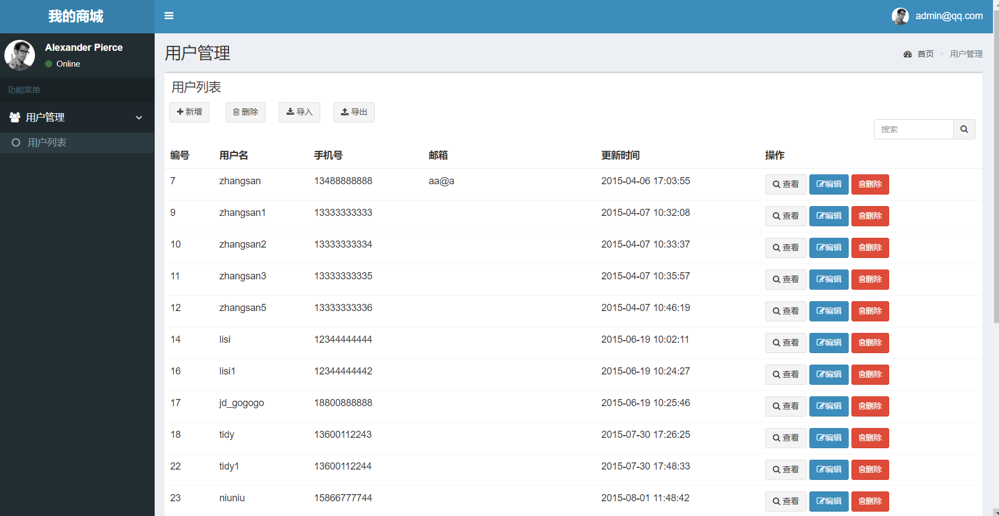

# 项目实战MyShop

## 首页

### 首页布局

​	　参考[这里](http://adminlte.la998.com/)重新编写MyShop的`mian.jsp`主页面。首先，在`WEB-INF`目录下新建`includes目录`，接着，将`nav.jsp`导航栏、`menu.jsp`菜单栏、`copyright.jsp`版权说明、`header.jsp`和`foot.jsp`资源引用等作为单独的页面抽出，并保存在`includes目录`下。

#### nav.jsp

```html
<%@ page contentType="text/html;charset=UTF-8" language="java" %>
<%@ taglib uri="http://java.sun.com/jsp/jstl/core" prefix="c" %>
<%@ taglib prefix="fmt" uri="http://java.sun.com/jsp/jstl/fmt" %>

<header class="main-header">
    <!-- Logo -->
    <a href="/main" class="logo">
        <!-- mini logo for sidebar mini 50x50 pixels -->
        <span class="logo-mini"><b>商城</b></span>
        <!-- logo for regular state and mobile devices -->
        <span class="logo-lg"><b>我的商城</b></span>
    </a>
    <!-- Header Navbar: style can be found in header.less -->
    <nav class="navbar navbar-static-top">
        <!-- Sidebar toggle button-->
        <a href="#" class="sidebar-toggle" data-toggle="push-menu" role="button">
            <span class="sr-only">Toggle navigation</span>
        </a>

        <div class="navbar-custom-menu">
            <ul class="nav navbar-nav">
                <!-- User Account: style can be found in dropdown.less -->
                <li class="dropdown user user-menu">
                    <a href="#" class="dropdown-toggle" data-toggle="dropdown">
                        
                        <span class="hidden-xs">${user.email}</span>
                    </a>
                    <ul class="dropdown-menu">
                        <!-- User image -->
                        <li class="user-header">
                            

                            <p>
                                ${user.userName} - 管理员
                                <small>
                                    <fmt:formatDate value="${user.createTime}" pattern="yyyy-MM-dd HH:mm:ss"/>
                                </small>
                            </p>
                        </li>
                        <!-- Menu Footer-->
                        <li class="user-footer">
                            <div class="pull-left">
                                <a href="#" class="btn btn-default btn-flat">个人信息</a>
                            </div>
                            <div class="pull-right">
                                <a href="/logout" class="btn btn-default btn-flat">注销</a>
                            </div>
                        </li>
                    </ul>
                </li>
            </ul>
        </div>
    </nav>
</header>
```


#### menu.jsp

```html
<%@ page contentType="text/html;charset=UTF-8" language="java" %>
<%@ taglib uri="http://java.sun.com/jsp/jstl/core" prefix="c" %>

<!-- Left side column. contains the logo and sidebar -->
<aside class="main-sidebar">
    <!-- sidebar: style can be found in sidebar.less -->
    <section class="sidebar">
        <!-- Sidebar user panel -->
        <div class="user-panel">
            <div class="pull-left image">
                
            </div>
            <div class="pull-left info">
                <p>Alexander Pierce</p>
                <a href="#"><i class="fa fa-circle text-success"></i> Online</a>
            </div>
        </div>

        <!-- sidebar menu: : style can be found in sidebar.less -->
        <ul class="sidebar-menu" data-widget="tree">
            <li class="header">功能菜单</li>
            <li class="active treeview">
                <a href="#">
                    <i class="fa fa-users"></i> <span>模块1</span>
                    <span class="pull-right-container">
                                  <i class="fa fa-angle-left pull-right"></i>
                                </span>
                </a>
                <ul class="treeview-menu">
                   
                </ul>
            </li>
        </ul>
    </section>
</aside>
```

#### copyright.jsp

```html
<%@ page contentType="text/html;charset=UTF-8" language="java" %>
<%@ taglib uri="http://java.sun.com/jsp/jstl/core" prefix="c" %>

<!-- /.content-wrapper -->
<footer class="main-footer">
    <div class="pull-right hidden-xs">
        <b>Version</b> 1.0.0
    </div>
    <strong>Copyright &copy; 2018-2020 <a href="https://github.com/sh086/myshop">MyShop</a>.</strong> All rights
    reserved.
</footer>
```


#### header.jsp

```html
<%@ page contentType="text/html;charset=UTF-8" language="java" %>
<%@ taglib uri="http://java.sun.com/jsp/jstl/core" prefix="c" %>

<meta charset="utf-8">
<meta http-equiv="X-UA-Compatible" content="IE=edge">
<!-- Tell the browser to be responsive to screen width -->
<meta content="width=device-width, initial-scale=1, maximum-scale=1, user-scalable=no" name="viewport">
<!-- Bootstrap 3.3.7 -->
<link rel="stylesheet" href="/static/assets/bower_components/bootstrap/dist/css/bootstrap.min.css">
<!-- Font Awesome -->
<link rel="stylesheet" href="/static/assets/bower_components/font-awesome/css/font-awesome.min.css">
<!-- Ionicons -->
<link rel="stylesheet" href="/static/assets/bower_components/Ionicons/css/ionicons.min.css">
<!-- Theme style -->
<link rel="stylesheet" href="/static/assets/css/AdminLTE.min.css">
<!-- AdminLTE Skins. Choose a skin from the css/skins
folder instead of downloading all of them to reduce the load. -->
<link rel="stylesheet" href="/static/assets/css/skins/_all-skins.min.css">
```


#### nav.jsp

```html
<%@ page contentType="text/html;charset=UTF-8" language="java" %>
<%@ taglib uri="http://java.sun.com/jsp/jstl/core" prefix="c" %>

<!-- HTML5 Shim and Respond.js IE8 support of HTML5 elements and media queries -->
<!-- WARNING: Respond.js doesn't work if you view the page via file:// -->
<!--[if lt IE 9]>
<script src="https://oss.maxcdn.com/html5shiv/3.7.3/html5shiv.min.js"></script>
<script src="https://oss.maxcdn.com/respond/1.4.2/respond.min.js"></script>
<![endif]-->
<!-- jQuery 3 -->
<script src="/static/assets/bower_components/jquery/dist/jquery.min.js"></script>
<!-- jQuery UI 1.11.4 -->
<script src="/static/assets/bower_components/jquery-ui/jquery-ui.min.js"></script>
<!-- Resolve conflict in jQuery UI tooltip with Bootstrap tooltip -->
<script>
    $.widget.bridge('uibutton', $.ui.button);
</script>
<!-- Bootstrap 3.3.7 -->
<script src="/static/assets/bower_components/bootstrap/dist/js/bootstrap.min.js"></script>
<!-- Slimscroll -->
<script src="/static/assets/bower_components/jquery-slimscroll/jquery.slimscroll.min.js"></script>
<!-- FastClick -->
<script src="/static/assets/bower_components/fastclick/lib/fastclick.js"></script>
<!-- AdminLTE App -->
<script src="/static/assets/js/adminlte.min.js"></script>
```


### 主页面

​	　在`main.jsp`中引入`includes`目录下的页面，即可完成主页面的模块化编辑。特别的，**`main.jsp`可以作为本项目的模板页面**。

```xml
<%@ page contentType="text/html;charset=UTF-8" language="java" %>
<%@ taglib uri="http://java.sun.com/jsp/jstl/core" prefix="c" %>

<!DOCTYPE html>
    <head>
        <title>我的商城 | 控制面板</title>
        <jsp:include page="../includes/header.jsp"/>
    </head>
    <body class="hold-transition skin-blue sidebar-mini">
        <div class="wrapper">

            <jsp:include page="../includes/nav.jsp"/>

            <jsp:include page="../includes/menu.jsp"/>

            <!-- Content Wrapper. Contains page content -->
            <div class="content-wrapper">
                <!-- Content Header (Page header) -->
                <section class="content-header">
                    <h1>
                        控制面板
                        <small></small>
                    </h1>
                    <ol class="breadcrumb">
                        <li><a href="#"><i class="fa fa-dashboard"></i> 首页</a></li>
                        <li class="active">控制面板</li>
                    </ol>
                </section>

                <!-- Main content -->
                <section class="content">

                </section>
            </div>

            <jsp:include page="../includes/copyright.jsp"/>

        </div>
        <jsp:include page="../includes/foot.jsp"/>
    </body>
</html>
```

​	　登录时，会首先调用`LoginController`中的`login`方法，若登录成功，会在`HttpServletRequest`对象`req`放入`键值对user`，`nav.jsp`页面就可以显示登录用户名、用户创建时间等信息了。

```java
//关键代码如下：
req.getSession().setAttribute(SessionConstant.SESSION_USER,user);
return "redirect:/main";
```


### 测试运行

​	　重新运行项目，可以看到`主页面`已经重新渲染成功了。


## 查询用户列表

### 编写业务代码

​	　新建`UserController`，并编写跳转用户列表页面的请求`/user/list`。

```java
/**
 * 用户管理
 * */
@Controller
@RequestMapping("/user/")
public class UserController {

    @Autowired
    private UserService userService;

    /**
     * 跳转用户列表页面
     * */
    @RequestMapping(value = "list",method = RequestMethod.GET)
    public String list(Model model){
        val users = userService.selectUserAll();
        model.addAttribute("users",users);
        return "user_list";
    }
}
```


### 用户列表页面

​	　首先，在`menu.jsp`中新增用户列表下拉项。

```html{3}
 <ul class="treeview-menu">
    <li>
        <a href="/user/list"><i class="fa fa-circle-o"></i> 用户列表</a>
    </li>
</ul>
```

​	　然后，新建`user_list.jsp`页面，使用`<c:forEach>标签` 遍历`users`属性，展示查询出来的全部的用户数据。

```html
<%@ page contentType="text/html;charset=UTF-8" language="java" %>
<%@ taglib uri="http://java.sun.com/jsp/jstl/core" prefix="c" %>
<%@ taglib prefix="fmt" uri="http://java.sun.com/jsp/jstl/fmt" %>

<!DOCTYPE html>
<head>
    <title>我的商城 | 用户管理</title>
    <jsp:include page="../includes/header.jsp"/>
</head>
<body class="hold-transition skin-blue sidebar-mini">
<div class="wrapper">

    <jsp:include page="../includes/nav.jsp"/>

    <jsp:include page="../includes/menu.jsp"/>

    <!-- Content Wrapper. Contains page content -->
    <div class="content-wrapper">
        <!-- Content Header (Page header) -->
        <section class="content-header">
            <h1>
                用户管理
                <small></small>
            </h1>
            <ol class="breadcrumb">
                <li><a href="#"><i class="fa fa-dashboard"></i> 首页</a></li>
                <li class="active">用户管理</li>
            </ol>
        </section>

        <!-- Main content -->
        <section class="content">
            <!-- /.row -->
            <div class="row">
                <div class="col-xs-12">
                    <div class="box">
                        <div class="box-header">
                            <h3 class="box-title">用户列表</h3>

                            <div class="row" style="padding-left: 12px;padding-top: 10px">
                                <a href="#" type="button" class="btn btn-sm btn-default"><i class="fa fa-plus"></i> 新增</a> &nbsp&nbsp&nbsp&nbsp
                                <a href="#" type="button" class="btn btn-sm btn-default"><i class="fa fa-trash-o"></i> 删除</a>&nbsp&nbsp&nbsp&nbsp
                                <a href="#" type="button" class="btn btn-sm btn-default"><i class="fa fa-download"></i> 导入</a>&nbsp&nbsp&nbsp&nbsp
                                <a href="#" type="button" class="btn btn-sm btn-default"><i class="fa fa-upload"></i> 导出</a>&nbsp&nbsp&nbsp&nbsp
                            </div>

                            <div class="box-tools">
                                <div class="input-group input-group-sm hidden-xs" style="width: 150px;">
                                    <input type="text" name="table_search" class="form-control pull-right" placeholder="搜索">

                                    <div class="input-group-btn">
                                        <button type="submit" class="btn btn-default"><i class="fa fa-search"></i></button>
                                    </div>
                                </div>
                            </div>
                        </div>
                        <!-- /.box-header -->
                        <div class="box-body table-responsive no-padding">
                            <table class="table table-hover">
                                <thead>
                                    <tr>
                                        <th>编号</th>
                                        <th>用户名</th>
                                        <th>手机号</th>
                                        <th>邮箱</th>
                                        <th>更新时间</th>
                                        <th>操作</th>
                                    </tr>
                                </thead>
                                <tbody>
                                    <c:forEach items="${users}" var="user">
                                        <tr>
                                            <td>${user.id}</td>
                                            <td>${user.userName}</td>
                                            <td>${user.phone}</td>
                                            <td>${user.email}</td>
                                            <td><fmt:formatDate value="${user.createTime}" pattern="yyyy-MM-dd HH:mm:ss"/></td>
                                            <td>
                                                <a href="#" type="button" class="btn btn-sm btn-default"><i class="fa fa-search"></i> 查看</a>
                                                <a href="#" type="button" class="btn btn-sm btn-primary"><i class="fa fa-edit"></i>编辑</a>
                                                <a href="#" type="button" class="btn btn-sm btn-danger"><i class="fa fa-trash-o"></i>删除</a>
                                            </td>
                                        </tr>
                                    </c:forEach>
                                </tbody>
                            </table>
                        </div>
                        <!-- /.box-body -->
                    </div>
                    <!-- /.box -->
                </div>
            </div>
        </section>
    </div>

    <jsp:include page="../includes/copyright.jsp"/>

</div>
<jsp:include page="../includes/foot.jsp"/>
</body>
</html>
```


### 测试运行

​	　重新运行项目，可以看到`用户列表`页面，已经将数据库中的全部用户都查询出来，并可以在页面上展示用户列表信息了。




## 新增用户

### 新增用户页面

​	　首先，在`menu.jsp`中新增用户列表下拉项。

```html{4}
 <ul class="treeview-menu">
    <li>
         <li><a href="/user/list"><i class="fa fa-circle-o"></i> 用户列表</a></li>
         <li><a href="/user/form"><i class="fa fa-circle-o"></i> 新增用户</a></li>
    </li>
</ul>
```

​	　然后，在`user_list.jsp`中为`新增`用户按钮，添加请求路径`/user/form`。

```html{2-4}
<div class="row" style="padding-left: 12px;padding-top: 10px">
     <a href="/user/form" type="button" class="btn btn-sm btn-default">
         <i class="fa fa-plus"></i> 新增
     </a> 
</div>
```

​	　接着，新建`user_form.jsp`页面，作为`新增或编辑`用户的展示页面。

```html
<%@ page contentType="text/html;charset=UTF-8" language="java" %>

<!DOCTYPE html>
<head>
    <title>我的商城 | 用户管理</title>
    <jsp:include page="../includes/header.jsp"/>
</head>
<body class="hold-transition skin-blue sidebar-mini">
<div class="wrapper">

    <jsp:include page="../includes/nav.jsp"/>

    <jsp:include page="../includes/menu.jsp"/>

    <!-- Content Wrapper. Contains page content -->
    <div class="content-wrapper">
        <!-- Content Header (Page header) -->
        <section class="content-header">
            <h1>
                ${user.id == null ? "新增" : "编辑"}用户
                <small></small>
            </h1>
            <ol class="breadcrumb">
                <li><a href="#"><i class="fa fa-dashboard"></i> 首页</a></li>
                <li class="active">${user.id == null ? "新增" : "编辑"}用户</li>
            </ol>
        </section>

        <!-- Main content -->
        <section class="content">

            <div class="row">
                <div class="col-md-12">
                    <!-- Horizontal Form -->
                    <div class="box box-info">
                        <div class="box-header with-border">
                            <h3 class="box-title">${user.id == null ? "新增" : "编辑"}用户</h3>
                        </div>
                        <!-- /.box-header -->
                        <!-- form start -->
                        <form id="inputForm" class="form-horizontal" action="#" method="post">
                            <div class="box-body">
                                <div class="form-group">
                                    <label for="email" class="col-sm-2 control-label">邮箱</label>

                                    <div class="col-sm-10">
                                        <input type="email" class="form-control" id="email"   placeholder="请输入邮箱"/>
                                    </div>
                                </div>
                                <div class="form-group">
                                    <label for="passWord" class="col-sm-2 control-label">密码</label>

                                    <div class="col-sm-10">
                                        <input type="password" class="form-control" id="passWord"  placeholder="请输入密码"/>
                                    </div>
                                </div>
                                <div class="form-group">
                                    <label for="userName" class="col-sm-2 control-label">姓名</label>

                                    <div class="col-sm-10">
                                        <input type="text" class="form-control" id="userName"  placeholder="请输入用户姓名"/>
                                    </div>
                                </div>
                                <div class="form-group">
                                    <label for="phone" class="col-sm-2 control-label">手机</label>

                                    <div class="col-sm-10">
                                        <input type="text" class="form-control" id="phone"  placeholder="请输入手机号"/>
                                    </div>
                                </div>
                            </div>
                            <!-- /.box-body -->
                            <div class="box-footer">
                                <button type="button" class="btn btn-default" onclick="history.go(-1)">返回</button>
                                <button type="submit" class="btn btn-info pull-right">提交</button>
                            </div>
                            <!-- /.box-footer -->
                        </form>
                    </div>
                </div>
            </div>
        </section>
    </div>

    <jsp:include page="../includes/copyright.jsp"/>

</div>
<jsp:include page="../includes/foot.jsp"/>
</body>
</html>
```


### 编写业务代码

​	　由于，将`user_form.jsp`作为`新增或编辑`的页面，并通过 `${user.id == null ? "新增" : "编辑"}用户`进行区分。所以，必须在**页面跳转**中将**非空的user对象**传到`user_form.jsp`页面上。`UserController`中，页面跳转方法有如下方法：

```java
/**
* 写法一：通过addAttribute显式添加（推荐）
* */
@RequestMapping(value = "form",method = RequestMethod.GET)
public String form(Model model){
    model.addAttribute("user",new User());
    return "user_form";
}

/**
* 写法二：自动会将形参user放入model中属性的（隐式添加）
* */
@RequestMapping(value = "form",method = RequestMethod.GET)
public String form(User user){
    return "user_form";
}

/**
* 写法三：通过@ModelAttribute在form()执行之前添加，不建议。
* */
@ModelAttribute
public User getUser(Long id){
    User user = null;
    if(id != null){
        user = userService.selectUserById(id);
    }else {
        user = new User();
    }
    return user;
}
@RequestMapping(value = "form",method = RequestMethod.GET)
public String form(){
    return "user_form";
}

```

### 测试运行

​	　重新运行项目，点击菜单栏中的`新增用户` 或者 `用户列表中的新增按钮`，都可以看到`新增用户页面`，


## 保存新用户

### 保存用户页面

​	　首先，在`user_form.jsp`中新增保存失败时，错误信息的显示。接着，再`<form>标签`中的`<input>标签`中添加`name="phone" value="${user.phone}"`属性，name属性用于设置提交时的变量名，value用于保存失败数据回显。

```xml
<!-- 第一步：添加jstl标签库 -->
<%@ taglib uri="http://java.sun.com/jsp/jstl/core" prefix="c" %>

<!-- 第二步：新增保存失败时，错误信息的显示-->
<!-- 添加位置： <div class="row"><div class="col-xs-12">-->
 <c:if test="${saveResult != null}">
     <div class="alert 
         alert-${saveResult.status ==  true ? "success" : "danger"} alert-dismissible">
        <button type="button" 
        	class="close" data-dismiss="alert" aria-hidden="true">&times;
        </button>
        ${saveResult.messages}
     </div>
</c:if> 

<!-- 第三步：在form中，为各个input标签添加 name 和 value 属性 -->
<input type="email" class="form-control" 
	id="email" name="email" value="${user.email}" placeholder="请输入邮箱"/>
```

​	　最后，按照和`user_form.jsp`的**第一步、第二步**的代码，完成`user_list.jsp`中对新增成功后，操作成功信息的提示。


### Form表单验证

#### RegexpUtils

```java
package com.shooter.funtl.common.utils;

/**
 * 正则表达式工具类
 */
public class RegexpUtils {
    /**
     * 验证手机号
     */
    public static final String PHONE = "^((13[0-9])|(15[^4,\\D])|(18[0,5-9]))\\d{8}$";

    /**
     * 验证邮箱地址
     */
    public static final String EMAIL = "\\w+(\\.\\w)*@\\w+(\\.\\w{2,3}){1,3}";

    /**
     * 验证手机号
     * @param phone
     * @return
     */
    public static boolean checkPhone(String phone) {
        return phone.matches(PHONE);
    }

    /**
     * 验证邮箱
     * @param email
     * @return
     */
    public static boolean checkEmail(String email) {
        return email.matches(EMAIL);
    }
}
```


#### jQuery Validation


### 编写业务代码

#### UserController

​	　`/user/save`的`请求参数`会映射到`user`形参中，同时，**`user`也会自动添加到model属性中**，可以用于保存失败后回显。若保存成功，需要重定向到`user_list.jsp`页面，此时`model`中保存的属性不能带入到`user_list.jsp`页面中，需要通过`addFlashAttribute`设置调转属性才可以。

```java
/**
* 保存用户表单
* */
@RequestMapping(value = "save",method = RequestMethod.POST)
public String save(User user, Model model,RedirectAttributes redirectAttributes){
    //保存用户表单
    val saveResult = userService.save(user);

    //保存成功
    if(saveResult.getStatus()){
        //设置调转属性
        redirectAttributes.addFlashAttribute("saveResult",saveResult);
        return "redirect:/user/list";
    }
    //保存失败
    else {
        model.addAttribute("saveResult",saveResult);
        return "user_form";
    }
}
```


#### UserService

```java
BaseResult save(User user);
```

实现方法：

```java
@Override
public BaseResult save(User user) {
    //校验用户有效性
    val checkResult = checkUser(user);
    if(checkResult != null){
        return checkResult;
    }
    //加密密码
    String md5PassWd = DigestUtils.md5DigestAsHex(user.getPassWord().getBytes());
    user.setPassWord(md5PassWd);
    //保存用户信息
    if(user.getId() != null){
        userDao.updateById(user);
    }else {
        userDao.insert(user);
    }
    return BaseResult.success("用户信息保存成功！");
}

/**
* 校验用户有效性
* */
private BaseResult checkUser(User user){
    //校验邮箱
    if(StringUtils.isBlank(user.getEmail())){
        return BaseResult.fail("邮箱不能为空，请重新输入！");
    }
    if(!RegexpUtils.checkEmail(user.getEmail())){
        return BaseResult.fail("邮箱格式不正确，请重新输入！");
    }
    val emailRecord = selectUserByEmail(user.getEmail());
    if(emailRecord != null){
        return BaseResult.fail("该邮箱已经存在，请重新输入！");
    }

    //校验密码
    if(StringUtils.isBlank(user.getPassWord())){
        return BaseResult.fail("密码不能为空，请重新输入！");
    }

    //校验姓名
    if(StringUtils.isBlank(user.getUserName())){
        return BaseResult.fail("姓名不能为空，请重新输入！");
    }
    val nameRecord = selectUserByName(user.getUserName());
    if(nameRecord != null){
        return BaseResult.fail("该姓名已经存在，请重新输入！");
    }

    if(user.getPhone() == null){
        return BaseResult.fail("手机不能为空，请重新输入！");
    }
    if(!RegexpUtils.checkPhone(String.valueOf(user.getPhone()))){
        return BaseResult.fail("手机格式不正确，请重新输入！");
    }
    return null;
}
```


#### BaseResult

```java
package com.shooter.funtl.common.dto;

import lombok.Data;
import lombok.val;
import java.io.Serializable;

@Data
public class BaseResult implements Serializable {

    private Boolean status;

    private String messages;

    private Object object;

    public static BaseResult success(String message){
        val result = new BaseResult();
        result.setStatus(true);
        result.setMessages(message);
        return result;
    }

    public static BaseResult fail(String message){
        val result = new BaseResult();
        result.setStatus(false);
        result.setMessages(message);
        return result;
    }
}
```


### SpringMVC标签库

​	　通过[spring标签库](../framework/jsp.md#springmvc表单标签库)不仅可以简化`<form>标签`中`<input>`的写法，还可以通过`modelAttribute`属性获取`/user/save`请求操作失败后回传的`user`值，并**自动回显**到各个控件中。

```xml{2,7,12,18,24,30}
<!-- 第一步：添加springmvc标签库 -->
<%@ taglib prefix="form" uri="http://www.springframework.org/tags/form" %>

<!-- 第二步：新增保存失败时，错误信息的显示-->
<!-- form start -->
<form:form id="inputForm" class="form-horizontal" 
           action="/user/save" method="post" modelAttribute="user">
  <div class="box-body">
     <div class="form-group">
        <label for="email" class="col-sm-2 control-label">邮箱</label>
        <div class="col-sm-10">
            <form:input class="form-control" path="email"  placeholder="请输入邮箱"/>
        </div>
      </div>
   <div class="form-group">
       <label for="passWord" class="col-sm-2 control-label">密码</label>
        <div class="col-sm-10">
           <form:password class="form-control" path="passWord"  placeholder="请输入密码"/>
        </div>
    </div>
    <div class="form-group">
         <label for="userName" class="col-sm-2 control-label">姓名</label>
         <div class="col-sm-10">
            <form:input class="form-control" path="userName"  placeholder="请输入用户姓名"/>
         </div>
     </div>
     <div class="form-group">
         <label for="phone" class="col-sm-2 control-label">手机</label>
         <div class="col-sm-10">
             <form:input class="form-control" path="phone"  placeholder="请输入手机号"/>
         </div>
     </div>
   </div>
   <!-- /.box-body -->
   <div class="box-footer">
      <button type="button" class="btn btn-default" onclick="history.go(-1)">返回</button>
      <button type="submit" class="btn btn-info pull-right">提交</button>
    </div>
    <!-- /.box-footer -->
</form:form>
```

​	　特别的，SpringMVC标签库要求`modelAttribute` **属性名必须设置** ，以及 **属性值必须为非空对象**，否则无法加载页面。示例： `跳转用户表单页面` 时没有设置`modelAttribute属性值`（如下），则加载`user_form`页面时页面就会报错，（解决办法参照[这里](#编写业务代码-2)）。

```java
/**
* UserController 跳转用户表单页面
* */
@RequestMapping(value = "form",method = RequestMethod.GET)
public String form(){
    //未在model空中设置user对象
    return "user_form";
}
```


### 测试运行

（1）若保存失败，显示失败原因，并且填写的用户信息会回显，特别的，**密码是不会回显的**。


（2）保存成功后，重定向到用户列表页面，并提示保存成功。


## Maven模块化开发