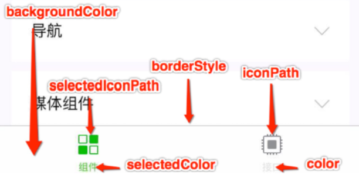

# 零基础玩转微信小程序

​	　微信小程序，简称小程序，英文名`Mini Program`，它通过尽可能简单、⾼效的⽅式让开发者可以在微信中开发具有原⽣ APP 体验的服务，实现了应用`触手可及`的梦想，用户扫一扫或者搜一下即可打开体验[应用](https://github.com/wechat-miniprogram/miniprogram-demo)。

**参考资料：**

- [微信小程序官方文档](https://developers.weixin.qq.com/miniprogram/dev/framework/)
- [视频教程](https://www.bilibili.com/video/BV1nE41117BQ?from=search&seid=7735600440888349321)
- [配套资料 - 提取码fk83](https://pan.baidu.com/s/17y6r44hrocXVjnPBVgJd5g)

**实战项目：**

- [黑马优购商城](./黑马优购商城.md)


## 快速开始

​	　首先，使用一个**没有注册过其他小程序或者公众号的邮箱**完成[注册](https://mp.weixin.qq.com/wxopen/waregister?action=step1)，注册通过后即可[登录](https://mp.weixin.qq.com/)小程序管理页面，点击右侧的`开发` -> `开发设置`，在`开发者ID`中找到**AppID**。

​	　接着，需要下载集成**开发、预览、调试、发布**于一身的[微信小程序开发工具](https://developers.weixin.qq.com/miniprogram/dev/devtools/download.html)，下载完后后，输入**项目名称**、**目录**，然后，在AppID点击使用**测试号**或者输入自己的**AppID**，最后点击`新建`按钮，即可完成小程序项目的新建。一个小程序基本的项目目录如下：

```
├── pages    页面文件夹
│   ├── index    首页    
│   │   ├── index.js      首页的逻辑文件
│   │   ├── index.json    首页的配置文件
│   │   ├── index.wxml    首页的标签文件
│   │   ├── index.wxss    首页的样式文件
│   ├── logs     日志页面    
│   │   ├── log.js      
│   │   ├── log.json    
│   │   ├── log.wxml    
│   │   ├── log.wxss    
├── utils    第三方的工具js（可删除）    
│   ├── utils.js 
├── app.js     入口文件
├── app.json   全局配置文件
├── app.wxss   全局样式文件
├── project.config.json   项目的配置文件
├── sitemap.json   微信索引配置文件
```

​	　微信⼩程序框架提供了⾃⼰的视图层描述语⾔ `WXML`(结构) 和 `WXSS`（样式） ，以及 `JavaScript` (逻辑)，并在视图层与逻辑层间提供了**数据传输**和**事件系统**，让开发者能够专注于数据与逻辑。特别的，对⽐传统web，微信⼩程序是**四层结构**，多了⼀层`JSON`( 配置)。


## 小程序配置

​	　[小程序配置](https://developers.weixin.qq.com/miniprogram/dev/reference/configuration/app.html)包括最基本的两种配置文件，一种是全局的配置文件`app.json`，另一种是页面配置文件`page.json`。此外，还有⽤于配置⼩程序及其⻚⾯是否允许被微信索引的`sitemap.json` 配置⽂件。 特别的，配置文件中不能出现注释。

### 全局配置

​	　⼩程序的全局配置文件`app.json`包括了⼩程序的所有⻚⾯路径、界⾯表现、⽹络超时时间、底部 `tabbar` 等。

1、`pages`标签

​	　`pages标签`用于指定小程序由哪些页面组成，每一项都对应一个页面的路径信息。**首页路径默认是pages字段中第一个路径**，也可通过`entryPagePath`指定首页。特别的，在微信开发者工具中编辑pages页面路径，点击保存，微信开发者工具会自动帮助你新建组件目录。

```json
{
  "pages":[
    "pages/index/index",
    "pages/logs/logs"
  ]
}
```


2、`window`标签

​	　`window标签`用于设置小程序所有⻚⾯的的状态栏、导航条、标题、顶部背景颜⾊、⽂字颜⾊定义等。

```json
{
  "window":{
    "navigationBarBackgroundColor": "#fff",
    "navigationBarTitleText": "Weixin",
    "navigationBarTextStyle":"black",
    "enablePullDownRefresh": true,
    "backgroundTextStyle":"dark",
    "backgroundColor": "#0094ff"
  }
}
# 顶部导航栏标签
navigationBarBackgroundColor: 导航栏背景颜色，只可使用十六进制，如：#fff
navigationBarTitleText ：导航栏标题
navigationBarTextStyle ：导航栏标题字体颜色,值只可为black或者white
# 下拉loading组件
enablePullDownRefresh：是否启用下拉刷新，值只可为true或false
backgroundTextStyle：下拉刷新时loading小圆圈的字体颜色，值只可为dark或者light
backgroundColor：下拉时loading的背景颜色，只可使用十六进制，如：#0094ff
```


3、`tabbar`标签

​	　`tabbar`标签定义小程序`导航栏`的相关属性。一个完整的`tabbar`标签由`list`和如下属性组成，特别的，`tabbar`中`list`需至少包含 2 项。



​	　`color`表示未选中图标名称，`iconPath`表示未选中的图标路径，`selectedColor`表示选中图标名称，`selectedIconPath`表示选中的图标路径，`backgroundColor`表示tabbar导航背景颜色，`borderStyle`表示tabbar边框颜色，`position`表示设置tabbar显示的位置，默认显示在底部，若值为top则会显示在顶部。pagePath表示图标对应的页面路径，text表示图标名称。

```json
{
  "tabBar": {
    "list": [
      {
        "pagePath": "pages/index/index", 
        "text": "首页",
        "iconPath": "icon/_home.png",
        "selectedIconPath": "icon/home.png"
      }
    ],
    "color": "#0094ff",
    "selectedColor": "#ff9400",
    "backgroundColor": "#ff5533",
    "position": "top"
  }
}
```


### 页面配置

​	　页面配置文件`page.json`主要用于表示**页面相关**配置，开发者可以独⽴定义每个⻚⾯的⼀些属性，如顶部颜⾊、是否允许下拉刷新等等。⻚⾯的配置只能设置 `app.json` 中部分 `window `配置项的内容**，**⻚⾯中配置项会覆盖 `app.json`的 `window` 中相同的配置项。

```json
{
  "usingComponents": {},
  "navigationBarBackgroundColor": "#0094aa",
  "navigationBarTitleText": "我的首页",
  "disableScroll": false
}
```

​	　特别的，页面配置文件`page.json`也有一些特殊的页面配置标签，只能用于页面配置。

```
disableScroll ：默认true，表示不能页面整体上下滚动，只有在页面配置中有效，无法在app.json中设置该项
pageOrientation：默认未开启，设置为"auto"表示开启页面横屏竖屏设置
```


## WXML语法

​	　`WXML`（WeiXin Markup Language）是框架设计的⼀套标签语⾔，结合基础组件、事件系统，可以构建出⻚⾯的结构。特别的，小程序不需要主动引入`JSON`文件、`WXSS`样式文件、`JS`文件等，小程序会自动引入同名文件的。

### 数据绑定

1、绑定页面数据

（1）在`.js`中添加数据

```js
Page({
  data: {
    num : 12,
    message : "HelloWord",
    isHappy : true,
    person :{
      name : "小明",
      age : 12
    }
  },
})
```

（2）在页面中绑定数据

```xml
<view> 绑定数字类型：{{num}} </view>
<view> 绑定字符串类型 ：{{message}} </view>
<view> 绑定bool类型：{{isHappy}} </view>
<view> 绑定Object类型：姓名-{{person.name}} 年龄-{{person.age}} </view>
```


2、绑定组件属性

（1）在`.js`中添加数据

```js
Page({
  data: {
     id : 1,
     num : 12
  },
})
```

（2）在页面中绑定组件属性

```xml
<view id = "item-{{id}}" data-num = "{{num}}"> 自定义组件属性 </view>
```

（3）结果展示

```xml
<view id="item-1" data-num="12"> HelloWord </view>
```


3、绑定bool类型充当属性

```xml
<!--checked默认为`true`，表示被选中  -->
<checkbox checked> </checkbox>
<!--设置checked值为`false`，表示未选中  -->
<checkbox checked="{{false}}"> </checkbox>

<!--错误写法：不要直接写 checked=false，因为这样的计算结果是⼀个字符串  -->
<checkbox checked=false> </checkbox>
<!--错误写法：花括号和引号之间如果有空格，将最终被解析成为字符串 -->
<checkbox checked="   {{false}}"> </checkbox>
```


### 运算表达式

​	　表达式包含算术运算表达式、字符串拼接、逻辑运算表达式、三元运算表达式等类型，表达式可以在**花括号**中执行。注意，花括号和引号之间如果有空格，将最终被解析成为字符串。

1、三元运算

```xml
<view hidden="{{flag ? true : false}}"> Hidden </view>
```


2、算术运算

（1）在`.js`中添加数据

```json
Page({
  data: {
    a: 1,
    b: 2,
    c: 3
 }
})
```

（2）在页面中绑定组件属性

```xml
<!--显示：3 + 3 + d-->
<view> {{a + b}} + {{c}} + d </view>
```


3、逻辑判断

```html
<view wx:if="{{length > 5}}"> </view>
```


4、字符串运算

（1）在`.js`中添加数据

```json
Page({
  data:{
    name: 'MINA'
 }
})
```

（2）在页面中绑定组件属性

```xml
<view>{{"hello" + name}}</view>
```


### 条件渲染

​	　条件渲染有通过`wx:if`进行条件渲染和通过`hidden`进行条件渲染两种方式。首先，在`data`中定义属性`condition`为`false`，用于语法用例。

```json
Page({
  data:{
    condition: false
 }
})
```

1、通过`wx:if`进行条件渲染

（1）单分支条件渲染

```xml
<view wx:if="{{condition}}">隐藏</view>
<view wx:if="{{!condition}}">显示</view>
```

（2）多分支条件渲染

```xml
<view wx:if="{{condition}}">路径1</view>
<view wx:elif="{{condition}}">路径2</view>
<view wx:else>路径3</view>
```

2、通过`hidden`进行条件渲染

​	　 `hidden`和`wx:if`都可以使标签显示或者隐藏，区别是当标签频繁的切换显示时优先使用 `hidden`；不常频繁切换时，优先使用`wx:if`。

```xml
<view hidden="{{condition}}"> Hidden </view>
<!--hidden默认为true，表示隐藏-->
<view hidden> Hidden </view>
```

​	　特别的，当通过添加样式的方式切换显示的时候，`hidden`属性不要和样式`display`一起使用，否则`display`的样式会将`hidden`覆盖掉的。如下代码中，`display`样式为显示，`hidden`为隐藏。但是`display`样式会覆盖掉`hidden`的样式，所以`hidden`会显示。

```xml
<view style="display: flex;" hidden="{{!condition}}"> hidden </view>
```


### 列表渲染

​	　首先，在`page`中准备好相关对象，接下来我们会通过`wx:for`对这个`list`进行列表渲染。

```json
Page({
  data: {
     numberList: [1,2], 
     objectList : [
       {id: 100, name : '小明'},
       {id: 101, name : '小红'}
     ],
     object : {id: 103, name : '小蓝'},
  },
})
```

1、通过`wx:for`进行列表渲染

​	　`wx:for`指定需要循环的数组或者对象；`wx:for-item`指定数组当前元素的变量名 ，默认为 `item`；`wx:for-index`指定数组当前下标的变量名默认为 `index`。**只有一层循环的时候**，`wx:for-item`和`wx:for-index`可以不写，采用默认的名称，但是当出现 **数组的嵌套循环** 的时候，`wx:for-item`和`wx:for-index`必须要明确，而且尤其需要注意绑定的元素和下标的变量名不能重名。

​       `wx:key` ⽤来提⾼数组渲染的性能，绑定的值可以是`String`类型，但必须是循环数组中的对象的**唯一属性**；也可以是保留字 ` * this`，它的意思是 `item`本⾝ ，` * this` 代表的必须是 **唯⼀的字符串或数组**。 

（1）遍历元素数组

​        使用`wx:for`遍历`numberList`，未指明`wx:for-item`和`wx:for-index`，所以采用当前元素变量名默认为`item`，下标的变量名默认为 `index`。由于`numberList`是一个不重复的数组，所以`wx:key`采用的是` *this`。

```xml
<view wx:for="{{numberList}}" wx:key="*this">
  索引：{{index}}  值 {{item}} 
</view>
```

运行结果：

```
索引：0 值 1
索引：1 值 2
```

（2）遍历对象数组

​        使用`wx:for`遍历`objectList`，指明`wx:for-item`表示当前元素变量名为`student`，指明`wx:for-index`表示下标的变量名为`number`，指明`wx:key`为`id`。

```xml
<view wx:for="{{objectList}}" wx:for-item="student" wx:for-index="number" wx:key="id">
  索引：{{number}}  编号： {{student.id}} 姓名： {{student.name}}
</view>
```

运行结果：

```
索引：0  编号： 100 姓名： 小明
索引：1  编号： 101 姓名： 小红
```

（3）遍历对象

​        使用`wx:for`遍历`object`，建议将`wx:for-index`指定为`key`，`wx:for-item`指定为`value`。

```xml
<view wx:for="{{object}}" wx:for-item="value" wx:for-index="key">
  索引：{{key}}  值 {{value}} 
</view>
```

运行结果：

```
索引：id  值 103
索引：name  值 小蓝
```


2、block

​        `block`是**占位符标签**，在渲染⼀个包含多节点的结构块时， **`block`标签最终不会被渲染成真正的DOM元素** ，而`view`在列表渲染时会作为一个真正的DOM元素渲染的。

```xml
<view wx:for="{{numberList}}">
  <view>索引：{{index}}  值 {{item}} </view>
</view >
```

运行结果：

```xml
<page>
    <view>
        <view>索引：0  值 1 </view>
    </view>
    <view>
        <view>索引：1  值 2 </view>
    </view>
</page>
```

​        我们可以使用`block`标签替代`view`标签，会发现block标签最终不会被渲染成DOM元素。

```xml
<block wx:for="{{numberList}}" wx:for-item="item" wx:for-index="index">
  <view>索引：{{index}}  值 {{item}} </view>
</block>
```

运行结果：

```xml
<page>
    <view>索引：0  值 1 </view>
    <view>索引：1  值 2 </view>
</page>
```


### 事件绑定

​        ⼩程序中绑定事件，通过`bind`关键字来实现，如 `bindtap`、`bindinput`、`bindchange`等，不同的组件⽀持不同的事件，具体看组件的说明即可。

（1）编写对象模型

```js
Page({
    data: {
     	value: 0
    }
})
```

（2）编写WXML页面

```xml
<view>
    <input type="text" value="{{value}}" bindinput="handleInput"/>
    <button bindtap="handleTap" data-operation="{{1}}">+</button>
    <button bindtap="handleTap" data-operation="{{-1}}">-</button>
</view>
```

​        `input`组件通过`bindinput`绑定了`handleInput`事件，该事件可以将用户在输入框输入的值绑定到`value`中，点击加号按钮，将加号按钮设置的参数值`1`传入`handleTap`进行运算，点击减号同理。

（3）事件绑定

```js
Page({
    data: {
     value: 0
    },
    handleInput: function(e) {
      this.setData({
        value : parseInt(e.detail.value)
      })
    },
    handleTap: function(e) {
      const operation = e.currentTarget.dataset.operation;
      this.setData({
        value : this.data.value + operation
      })
    }
})
```

（4）特别注意

① 绑定事件时**不能带参数**、**不能带括号** ，传参需要使用`data-参数名`设置需要传入的自定义属性，然后通过`事件源e`取用设置的自定义属性。

```xml
<!--错误写法-->
<input bindinput="handleInput(100)" />
<!--正确写法-->
<input bindinput="handleInput" data-item="100" />

<!--e是事件源，包含了事件的信息-->
e.currentTarget.dataset.参数名 自定义属性值
e.detail.value 				  输入组件的值
e.detail 					  传递过来的值
```

② 绑定的事件中，可以通过`this.data.value`取用value值，但是**不能通过`this.data.value`设置value值**，设置value需要通过`this.setData({})`方法

```js
//取用值正确写法
const number = this.data.value
//设置值正确写法
this.setData({
	value : 2
})
//设置值错误写法
this.data.value = 2
```


## WXSS样式

​	　`WXSS`( WeiXin Style Sheets )是⼀套样式语⾔，⽤于描述 `WXML` 的组件样式。 与 `CSS` 相⽐，`WXSS` 扩展特性有**响应式⻓度单位 `rpx`** 和 **样式导⼊**。

### 尺寸单位

​	　响应式⻓度单位 `rpx` （responsive pixel）可以根据屏幕宽度进⾏⾃适应。规定屏幕宽为 `750rpx` ，如在iPhone6 上，屏幕宽度为 `375px` ，共有`750个物理像素`，则 ：

```
750rpx = 375px = 750  物理像素
1rpx = 0.5px = 1      物理像素
```

​	　建议开发微信⼩程序时设计师可以⽤ `iPhone6` 作为视觉稿的标准。开发时需要把视觉稿中元素的单位由 `px` 改成 `rpx`，计算步骤如下： 

```
1. 确定设计稿宽度 pageWidth 
2. 计算⽐例 750rpx = pageWidth px ,因此 1px = 750rpx /pageWidth 
3. 最终公式：m px = 750rpx * m / pageWidth
```

​	　例如，存在一个设计稿宽度是`414px`，而且设计稿中存在一个宽度是`100px`、高`200px`的蓝色区域，将`px`转为`rpx`的写法如下，特别注意，`750rpx`的`750` 和 `rpx`中间 不能存在空格。

```css
view{
  width:calc(750rpx * 100 / 414);
  height: calc(750rpx * 200 / 414);
}
```


### 选择器

⽬前⽀持的选择器有：

|      选择器      |       样例        |                    样例描述                    |
| :--------------: | :---------------: | :--------------------------------------------: |
|      .class      |      .intro       |        选择所有拥有 class="intro"的组件        |
|       #id        |        #id        |         选择拥有 id="firstname"的组件          |
|     element      |       view        |               选择所有 view 组件               |
| element, element |   view,checkbox   | 选择所有⽂档的 view 组件和所有的 checkbox 组件 |
|   nth-child(n)   | view:nth-child(n) |               选择某个索引的标签               |
|     ::after      |    view::after    |            在 view 组件后边插⼊内容            |
|     ::before     |   view::before    |            在 view 组件前边插⼊内容            |

**特别注意**： ⼩程序 不⽀持`通配符 *` 因此以下代码⽆效：

```css
*{
    margin:0;
    padding:0;
    box-sizing:border-box; 
}
```


### 样式导入

​	　`wxss`中可以使⽤ `@import` 语句导⼊外联样式表，但注意**只⽀持相对路径**，`wxss`样式文件引入方式如下：

```css
/** 编写 common.wxss样式文件 **/
.small-p {
  padding:5px; 
}
/** 在wxss中导入common.wxss文件 **/
@import "common.wxss";
.middle-p {
  padding:15px; 
}
```

​	　此外，也可以使用`VScode`编辑器的`less`转`wxss`功能，通过编写`less`文件来完成`wxss`样式导入。首先，需要在`VScode`编辑器中下载`easy Less`插件，安装完成后，继续在`VScode`的设置中加入如下配置：

```json
"less.compile": {
	"outExt": ".wxss"
}
```

​	　接着，新建`common.less` ，并定义`less`变量。

```css
@color: yellow;
```

​	　然后，在`VSCode`中新增与`wxss`的同名文件`less`，可以在该同名`less`文件中使⽤ `@import 语句`导⼊外联`less`样式表，但注意只⽀持相对路径。

```css
@import "common.less";
/**单行样式**/
text{
  color: @color;
}
/**嵌套样式**/
view{
  .vie1{
      text{
          color: @color;
      }
  }
}
```

​	　`less`文件编辑完成并保存后，`VSCode`即可根据`less`文件在`wxss`文件中生成对应`wxssَ`样式，生成的`wxssَ`样式如下：

```css
text{
  color: yellow;
}

view .vie1 text{
    color: yellow;
}
```


## 常见组件

### view和text

1、`view`组件

​	　`view`相当于HTML中的`div`标签，是一个**块级元素**，会换行展示。

```xml
<view> 
    This is View 
</view>
```


2、`text`组件

​	　文本标签`text`相当于HTML中的`span`标签，是一个**行内元素**，不会换行展示，而且，**`text`标签只能嵌套`text`标签**。`text`组件常见有`selectable`和`decode`两个属性，`selectable`表示**是否可以长按文字复制**，只有`text`标签有`selectable`属性，且只能在真机调试中测试。`decode`表示**是否解码**，为`true`时文本会被解码，为`false`则原样输出，默认`false`。

```xml
<!--解码输出：算式： 1 < 2-->
<text decode="{{true}}"> 算式：&nbsp; 1 &lt; 2 </text>
<!--原样输出：&nbsp;-->
<text decode="{{false}}"> &nbsp;</text>
<!--text标签只能嵌套text标签-->
<text> 
    <text>This is text</text>
</text>
```


### image

|  属性名   |  类型   |   默认值    |         说明         |
| :-------: | :-----: | :---------: | :------------------: |
|    src    | String  |             |     图⽚资源地址     |
|   mode    | String  | scaleToFill | 图⽚裁剪、缩放的模式 |
| lazy-load | Boolean |    false    |      图⽚懒加载      |

（1）src图⽚资源地址

​	　`src`属性值可以是**文件流**也可以是**文件地址**，特别的，由于微信小程序要求程序打包上线的大小不能超过`2M`，所以**建议将静态资源都放到线上**。

```html
 <image src="https://tva2.sinaimg.cn/large/007DFXDhgy1g51jlzfb4lj305k02s0sp.jpg" />
```

（2）图片缩放与裁剪

​	　`image`组件中`mode`决定**图片内容**如何和**图片标签宽高**做适配的。图片的**默认宽度是320px、高度是240px**。若`image`组件的宽高未设置，则`image`组件宽高默认是图片的宽高。

​	　`mode` 有 `13种`模式，其中 `4种`是缩放模式，`9种`是裁剪模式。**缩放模式**是根据约定的模式缩放图片宽高；**裁剪模式**是图片宽高不变，在`image`组件中按照特点的方式显示图片。

| 模式 |     值      | 说明                                                         |
| :--: | :---------: | :----------------------------------------------------------- |
| 缩放 | scaleToFill | 默认值，表示不保持纵横比缩放图片，使图⽚的宽⾼完全拉伸⾄填满image 元素 |
| 缩放 |  aspectFit  | 保持纵横⽐缩放图⽚，使图⽚的⻓边能完全显⽰出来，多用于页面轮播图 |
| 缩放 | aspectFill  | 保持纵横⽐缩放图⽚，只保证图⽚的短边能完全显⽰出来，并会做居中处理 |
| 缩放 |  widthFix   | 宽度不变，⾼度⾃动变化（不受image组件高度的限制），保持原图宽⾼⽐不变 |
| 裁剪 |   bottom    | 不缩放图⽚，只显⽰图⽚的底部区域                             |

（3）懒加载

​	　微信小程序中图片直接就支持懒加载，当图片出现在**视口上下三屏高度之内**的时候，`lazy-load`便会开始加载图片。

```html
 <image lazy-load src="https://tva2.sinaimg.cn/large/007DFXDhgy1g51jlzfb4lj305k02s0sp.jpg" />
```


### swiper

​	　`swiper`是微信内置的`轮播图`组件，是滑块视图容器，`swiper-item`是轮播图里面的`滑块`组件。

（1）`swiper`常用属性

|         属性名         |  类型   |      默认值       |         说明         |
| :--------------------: | :-----: | :---------------: | :------------------: |
|     indicator-dots     | Boolean |       false       |  是否显⽰⾯板指⽰点  |
|    indicator-color     |  Color  | rgba(0, 0, 0, .3) |      指⽰点颜⾊      |
| indicator-active-color |  Color  |     `#000000`     | 当前选中的指⽰点颜⾊ |
|        autoplay        | Boolean |       false       |     是否⾃动切换     |
|        interval        | Number  |       5000        |   ⾃动切换时间间隔   |
|        circular        | Boolean |       false       |     是否循环轮播     |

（2）图片适应`swiper`的宽高

​	　`swiper`组件存在默认样式，**默认宽度是100%，默认高度是150px**；`swiper-item`组件**默认宽度和高度都是100%**。当swiper组件的默认高度无法实现内容撑开的时候，需要依据原图的宽度和高度，自定义`swiper`的高度和宽度。 swiper高度计算公式为：

```
∵ swiper宽度 / swiper高度 = 原图宽度 / 原图高度
∴ swiper高度 = swiper宽度 * 原图高度 / 原图宽度
==> swiper高度 =  calc(100vw * 原图高度 / 原图宽度)
说明：swiper宽度是一个固定值，可以写成 750rpx ,也可以写成 100vw
```

（3）代码示例

​	　原图宽高为`1125*352`像素的图片，首先`images`样式写入`width: 100%`；表明采用`images`默认样式，即宽高为`320px*240px`；然后设定`swiper`组件的`mode="widthFix"` ，表明将原图宽度缩放到`320px`，高根据比例进行缩放为`100px`。而`swiper`组件默认宽度是`100%`，默认高度是`150px`，即`320px*150px`，此时图片高度不能将`swiper`组件完全撑开，导致面板指⽰点的显示位置不准确（面板指⽰点是跟随swiper组件底部显示的），所以，需要依据原图的高度，自定义`swiper`的高度。

```css
swiper {
  width: 100%; 
  height: calc(100vw * 352 /  1125); 
}
image {
  width: 100%;
}
```

​	　`swiper`样式编写完成后，继续完成轮播图`WXML`代码的编写，然后，即可看到轮播图正常运行了。

```html
<swiper autoplay circular interval="1000" 
        indicator-dots indicator-color="#0094ff" 
        indicator-active-color="#ff0094">
    <swiper-item> 
      <image mode="widthFix" 
             src="轮播图网页图片1.jpg" /> 
    </swiper-item>
    <swiper-item> 
      <image mode="widthFix" 
             src="轮播图网页图片2.jpg" /> 
    </swiper-item>
    <swiper-item> 
      <image mode="widthFix" 
             src="轮播图网页图片3.jpg" /> 
    </swiper-item>
</swiper>
```


### navigator

​	　`navigator`是导航组件，类似于超链接标签，`navigator`常用属性如下：

|  属性名   |  类型  |  默认值  |                             说明                             |
| :-------: | :----: | :------: | :----------------------------------------------------------: |
|  target   | String |   self   | 在哪个⽬标上发⽣跳转，默认当前⼩程序，可选值 `self`或者`miniProgram` |
|    url    | String |          |                    当前⼩程序内的跳转链接                    |
| open-type | String | navigate |                           跳转⽅式                           |

（1）`url`属性

​	　 `url`属性表示要跳转的页面路径，可以是 **绝对路径** 也可以是 **相对路径**。跳转的路径指向的是`wxml`文件，但是无需加`.wxml`后缀名。

```html
<navigator url='/pages/mine/mine'>跳转页面</navigator>
```

（2）`target`跳转目标类型

|     值      | 说明                               |
| :---------: | ---------------------------------- |
|    self     | 默认值，只能跳转到当前小程序的页面 |
| miniProgram | 可以跳转到其他小程序页面中         |

示例代码：

```html
<navigator target="self" url='/pages/mine/mine'>跳转页面</navigator>
```

（3）`open-type`跳转⽅式

|      值      | 说明                                                         |
| :----------: | ------------------------------------------------------------ |
|   navigate   | 默认值，保留当前⻚⾯，跳转到应⽤内的某个⻚⾯，但是不能跳到tabbar ⻚⾯ |
|   redirect   | 关闭当前⻚⾯，跳转到应⽤内的某个⻚⾯，但是不允许跳转到tabbar ⻚⾯。 |
|  switchTab   | 跳转到 tabBar ⻚⾯，并关闭其他所有⾮ tabBar ⻚⾯             |
|   reLaunch   | 关闭所有⻚⾯，打开到应⽤内的某个⻚⾯                         |
| navigateBack | 关闭当前⻚⾯，返回上⼀⻚⾯或多级⻚⾯。可通过 `getCurrentPages()` 获取当前的⻚⾯栈，决定需要返回⼏层 |
|     exit     | 退出⼩程序，target=miniProgram时⽣效                         |


### icon

| 属性  | 类型          | 默认值 | 必填 | 说明                                     |
| ----- | ------------- | ------ | ---- | ---------------------------------------- |
| type  | string        |        | 是   | icon的类型，不同的type表示不同的icon图标 |
| size  | number/string | 23     | 否   | icon的⼤⼩                               |
| color | string        |        | 否   | icon的颜⾊，同css的color                 |

（1）Page数据

```js
Page({
   data: {
     iconSize: [20, 30, 40, 50, 60, 70],
     // icon组件中type属性的有效值
     iconType: [
         'success', 'success_no_circle', 'info', 'warn', 'waiting', 
         'cancel', 'download','search', 'clear'
    ],
     iconColor: [
       'red', 'orange', 'yellow', 'green', 'rgb(0,255,255)', 'blue', 'purple'
    ],
  }
 })
```

（2）WXML标签

```html
<!--大小-->
<view class="group">
  <block wx:for="{{iconSize}}">
    <icon type="success" size="{{item}}"/>
  </block>
</view> 
<!--类型-->
<view class="group">
  <block wx:for="{{iconType}}">
    <icon type="{{item}}" size="40"/>
  </block>
</view> 
<!--颜色-->
<view class="group">
  <block wx:for="{{iconColor}}">
    <icon type="success" size="40" color="{{item}}"/>
  </block>
</view>
```


### rich-text

​	　`rich-text`是富文本标签，使用`nodes`属性可以**将字符串解析成对应标签**，类似 `vue`中 `v-html`功能。 `nodes` 属性⽀持 **字符串** 和 **标签节点数组**，但不推荐使⽤String类型，因为性能会有所下降。特别注意，`rich-text` 组件内屏蔽所有节点的事件，并且`img` 标签仅⽀持⽹络图⽚。

1、解析html字符串 [最常使用]

```xml
<rich-text 
  nodes='' >
</rich-text>
```

2、使用标签节点数组

（1）标签节点数组属性

​	　`attrs` 属性不⽀持 `id` ，⽀持 `class`；`name` 属性⼤⼩写不敏感。特别的，如果使⽤了不受信任的 HTML 节点，该节点及其所有⼦节点将会被移除。

|   属性   |    说明    |  类型  | 必填 |                   备注                   |
| :------: | :--------: | :----: | :--: | :--------------------------------------: |
|   name   |   标签名   | string |  是  |        ⽀持部分受信任的 HTML 节点        |
|  attrs   |    属性    | object |  否  | ⽀持部分受信任的属性，遵循 Pascal 命名法 |
| children | ⼦节点列表 | array  |  否  |            结构和 nodes ⼀致             |

​	　对于⽂本节点`type = text`，相关属性如下：

| 属性 | 说明 |  类型  | 必填 |     备注     |
| :--: | :--: | :----: | :--: | :----------: |
| text | ⽂本 | string |  是  | ⽀持entities |

3、示例代码

（1）Page数据

```js
Page({
  data: {
    nodes:[
      {
        // 1 div标签 name属性来指定
        name:"div",
        // 2 标签上有哪些属性
        attrs:{
          // 标签上的属性 class  style
          class:"my_div",
          style:"color:red;"
        },
        // 3 子节点children要接收的数据类型 结构和nodes⼀致 或者 是text文本类型
        children:[
          {
            type:"text",
            text:"Hello&nbsp;World!"
          }
        ]
      }
    ]
  }
})
```

（2）WXML标签

```xml
<!--显示结果：Hello World!-->
<rich-text nodes="{{nodes}}"></rich-text>
```


### button

（1）`button`组件常见属性

|   属性    |  类型   | 默认值  |                             说明                             |
| :-------: | :-----: | :-----: | :----------------------------------------------------------: |
|   size    | string  | default |     按钮的大小，可选default（默认⼤⼩）、mini（小尺寸）      |
|   type    | string  | default | 按钮的样式类型，可选default（白色）、primary（绿色）、warn（红色） |
|   plain   | boolean |  false  |                   按钮是否镂空，背景色透明                   |
| disabled  | boolean |  false  |                           是否禁用                           |
|  loading  | boolean |  false  |                  名称前是否带 loading 图标                   |
| form-type | string  |         | 触发组件的 submit/reset 事件，可选submit（提交表单）、reset（重置表单） |
| open-type | string  |         |                         微信开放能⼒                         |

示例代码：

```html
<button type="default"  size="{{defaultSize}}" loading="{{loading}}" plain="{{plain}}">
     default
</button>
```

（2）`open-type`微信开发能力

​	　如果需要使用微信开发者功能，则首先需要将⼩程序 的 `appid` 由测试号改为 ⾃⼰的 `appid` 才能使用。

|       值       | 说明                                                         |
| :------------: | :----------------------------------------------------------- |
|    contact     | 打开客服会话。该功能需要登录微信⼩程序官⽹，在 `客服 - 微信`中配置客服微信，如果⽤⼾在会话中点击消息卡⽚后返回⼩程序，可以从 `bindcontact` 回调中获得具体信息 |
|     share      | 转发当前小程序到微信朋友中，但不能把小程序分享到朋友圈       |
| getPhoneNumber | 若是企业小程序账户，则可以获取⽤⼾⼿机号，可以从`bindgetphonenumber`回调中获取到⽤⼾信息，但是获取的信息是加密的 |
|  getUserInfo   | 获取⽤⼾信息。可以从`bindgetuserinfo`回调中获取到⽤⼾信息，信息未进行加密处理 |
|   launchApp    | 在小程序中直接打开APP，可以通过`app-parameter`属性设定向APP传的参数 |
|  openSetting   | 打开小程序内置的授权页面                                     |
|    feedback    | 打开“意⻅反馈”⻚⾯。⽤⼾可提交反馈内容并上传⽇志，开发者可以登 录⼩程序管理后台后进⼊左侧菜单“客服反馈”⻚⾯获取到反馈内容 |

（3）`open-type` 的 `contact` 的示例代码


### checkbox

​	　`checkbox`组件必须要和父元素 `checkbox-group`组合来使用，`value`属性表示选中的复选框的值。示例代码如下：

（1） Page数据

```js
Page({
    data: {
      checkList:[],
      list:[
        {"id":1, value: "草莓"},
        {"id":2, value: "西瓜"},
      ]
  	},
  	hangdleChange(e){
        const checkList = e.detail.value;
        this.setData({
          checkList
        })
  	}
 })
```


（2）WXML页面

```html
<checkbox-group bindchange = 'hangdleChange'>
  <checkbox value="{{item.value}}" wx:for="{{list}}" wx:key="id">
    {{item.value}}
  </checkbox>
</checkbox-group>

<view>您选中的是：{{checkList}}</view>
```


### radio

​	　`radio`是单选框标签，`radio`组件必须要和 父元素 `radio-group`来使用，`value`属性表示选中的单选框的值。示例代码如下：

（1） Page数据

```js
Page({
   data: {
      gender:"",
  },
  hangdleChange(e){
    const gender = e.detail.value;
    this.setData({
      gender
    })
  }
 })
```


（2） WXML页面

```html
<radio-group bindchange = 'hangdleChange'>
  <radio value="male">男</radio>
  <radio value="female">女</radio>
</radio-group>

<view>您选中的是：{{gender}}</view>
```


## 自定义组件

### Tabs组件

（1）声明组件

​	　⼩程序允许我们使⽤⾃定义组件的⽅式来构建⻚⾯，一个自定义组件由 `json`、`wxml`、`wxss`、`js` 四个文件组成。可在微信开发者⼯具中通过`新建Component`的功能，快速创建组件的四个⽂件结构。

```
| -- components
| ------ tabs
| ---------- tabs.wxml
| ---------- tabs.json
| ---------- tabs.wxss
| ---------- tabs.js
```

​	　接着，需要在组件的 `json` ⽂件中进⾏**⾃定义组件声明**。

```json
{
  "component": true
}
```


（2）注册组件

​	　在组件的 `js` ⽂件中，使⽤ `Component()` 来**注册组件**，并提供组件的`属性定义`、`内部数据`和 `⾃定义⽅法`等。特别的， 组件`.js` 文件中存放事件回调函数的时候 必须要存在在 `methods`中。

```js
Component({
   data: {
      // 这里是一些组件内部数据
      tabs : [
      {
        id:0,
        name: "首页",
        isActive:true
      },
        {
          id:1,
          name: "原创",
          isActive:false
        },
        {
          id:2,
          name: "分类",
          isActive:false
        },
        {
          id:3,
          name: "关于",
          isActive:false
        }
      ]
   },
   methods: {
     // 这里是一个自定义方法
     hanldeItemTap (e) {
        // 获取当前索引
        const {index}=e.currentTarget.dataset;
        //通过解构获取data中的数组
        let {tabs} = this.data;
        //给当前的索引的项添加激活选中效果
        tabs.forEach((v,i) => i === index ? 
              v.isActive = true : v.isActive = false)
        this.setData({
          tabs
        })
      }
   }
 })
```

​	　对复杂类型进行解构时，仅是复制了一份变量的引用而已，最严谨的做法重新拷贝一份 数组，再对这个数组的备份进行处理，不要直接修改 `this.data  `数据 。

```js
let tabs=JSON.parse(JSON.stringify(this.data.tabs));
```

（3）组件样式

​	　在组件的 `WXSS`文件中编写样式，该样式只应用于这个自定义组件。特别的，在`WXSS`中不应使用ID选择器、属性选择器和标签名选择器 。

```css
.tabs_title{
  display: flex;
  padding: 10rpx 0;
}
.title_item{
  flex : 1;
  display: flex;
  justify-content: center;
  align-items: center;
}
.active{
  color: red;
  border-bottom: 5px solid currentColor;
}
```


（4）组件模板

​	　最后，还需要在组件的 `wxml` ⽂件中编写组件模板。特别的，`slot` 标签 其实就是一个占位符 插槽 ，等到 父组件调用 子组件的时候 ，再将 父组件标签 传递到 子组件中`slot` 插槽的位置 进行显示 。

```html
<view class="tabs_title">
	<view
		wx:for="{{tabs}}"
		wx:key="id"
		class="title_item {{item.isActive ? 'active' : ''}}"
		bindtap="hanldeItemTap"
		data-index="{{index}}">
			{{item.name}}
	</view>
</view>
<view>
    <slot></slot>
</view>
```


（5）引用自定义组件

​	　首先，要在⻚⾯的 `json` ⽂件中进⾏**引⽤声明**，需要提供对应的**组件名**和**组件路径**。

```json
{
  "usingComponents": {
    "Tabs": "../components/tabs/tabs"
  }
}
```

​	　接着，就可以在`wxml`页面中引用这个组件了。

```html
<view>
  <!-- 以下是对一个自定义组件的引用 -->
  <Tabs>
    <block> 文本内容 </block>
  </Tabs>
</view>
```


### Component构造器

​	　在组件的 `js` ⽂件中，`Component` 构造器可⽤于定义组件，调⽤ `Component` 构造器时可以指定组件的属性、数据、⽅法 等。

| 定义段     | 类型       | 是否必填 | 描述                                                         |
| ---------- | ---------- | :------: | ------------------------------------------------------------ |
| properties | Object Map |    否    | 组件的对外属性，是属性名到属性设置的映射表                   |
| data       | Object     |    否    | 组件的内部数据，和 properties ⼀同⽤于组件的模板渲染         |
| observers  | Object     |    否    | 组件数据字段监听器，⽤于监听properties 和 data 的变化        |
| methods    | Object     |    否    | 组件的⽅法，包括事件响应函数和任意的⾃定义⽅法               |
| created    | Function   |    否    | 组件⽣命周期函数，在组件实例刚刚被创建时执⾏，注意此时不能调⽤ setData |
| attached   | Function   |    否    | 组件⽣命周期函数，在组件实例进⼊⻚⾯节点树时执⾏             |
| ready      | Function   |    否    | 组件⽣命周期函数，在组件布局完成后执⾏                       |
| moved      | Function   |    否    | 组件⽣命周期函数，在组件实例被移动到节点树另⼀个位置时执⾏   |
| detached   | Function   |    否    | 组件⽣命周期函数，在组件实例被从⻚⾯节点树移除时执⾏         |


### 自定义组件传参

​	　自定义组件传参有**⽗组件通过属性给⼦组件传递参数** 和 **⼦组件通过事件向⽗组件传递参数** 两种方式。

1、⽗组件通过`properties`向⼦组件传递参数

（1）在子组件中新增`properties` 属性

​	　子组件中`properties`里面存放的是要从父组件中接收的属性定义，包括要接收的名称、数据类型和默认值，子组件可以当做`data`中的数据直接使用。

```js
Component({
  /**
   * 里面存放的是 要从父组件中接收的数据
   */
  properties: {
    // 要接收的数据的名称
    tabs:{
      // type  要接收的数据的类型 
      type:Array,
      // value  默认值
      value:[]
    }
  },
  // methods（略）
})
```

​	　特别的，可以通过`this.data`获取`properties`中的`tabs`值，但是不能通过`setData`方法修改`tabs`值，若想修改`properties`的属性值，只能通过事件调用父组件的方法进行修改。

（2）在父组件`JS`中新增`tabs`数据

```js
Page({
  // 父组件初始数据
  data: {
    tabs: [
      {
        id: 0,
        name: "首页",
        isActive: true
      },
      {
        id: 1,
        name: "原创",
        isActive: false
      }
      ,
      {
        id: 2,
        name: "分类",
        isActive: false
      }
      ,
      {
        id: 3,
        name: "关于",
        isActive: false
      }
    ]
  }
})
```

（3）父组件将`tabs`数据传给子组件

```html
<view>
  <!-- 以下是对一个自定义组件的引用 -->
  <Tabs tabs="{{tabs}}">
    <block> 文本内容 </block>
  </Tabs>
</view>
```


2 、子组件通过事件向⽗组件传递参数

​        子组件是不能直接修改父组件的属性的，需要在子组件点击事件触发时，通过调用`triggerEvent`方法触发父组件中的自定义事件， 并传递参数给父组件。

```js
this.triggerEvent("父组件自定义事件的名称",要传递的参数)
```

（1）在父组件中新增自定义事件

```js
Page({
  // 父组件data初始数据 （略）
    
  // 自定义事件 用来接收子组件传递的数据的
  handleItemChange(e) {
    // 接收传递过来的参数
    const { index } = e.detail;
    let { tabs } = this.data;
    tabs.forEach((v, i) => i === index ? v.isActive = true : v.isActive = false);
    this.setData({
      tabs
    })
  }
})
```

（2） 子组件绑定父组件的自定义事件`itemChange`，并将参数传递到父组件中

```js
Component({
  //要从父组件中接收的数据tabs (略)
    
  methods: {
    // 绑定父组件的自定义事件itemChange
    hanldeItemTap(e){
      const {index}=e.currentTarget.dataset;
      this.triggerEvent("itemChange",{index});
    }
  }
})
```

（3）在父组件中绑定自定义事件`itemChange`到`handleItemChange`方法

```html
<view>
 <!-- 以下是对一个自定义组件的引用 -->
 <Tabs tabs="{{tabs}}" binditemChange="handleItemChange" >
    <block wx:if="{{tabs[0].isActive}}">0 </block>
    <block wx:elif="{{tabs[1].isActive}}">1 </block>
    <block wx:elif="{{tabs[2].isActive}}">2 </block>
    <block wx:else>3</block>
 </Tabs>
</view>
```


## 小程序生命周期

1、应用生命周期

| 属性           | 类型     | 说明                                                         |
| -------------- | -------- | ------------------------------------------------------------ |
| onLaunch       | function | 监听⼩程序初始化，应用第一次启动时触发                       |
| onShow         | function | 监听⼩程序启动或切前台                                       |
| onHide         | function | 监听⼩程序切后台                                             |
| onError        | function | 错误监听函数，在应用发生代码报错时，收集用户的错误信息，通过异步请求，将错误的信息发送到后台 |
| onPageNotFound | function | 应用第一次启动时，若找不到第一个入口页面，才会触发           |

2、[页面生命周期](https://img-blog.csdnimg.cn/20191218104614842.png?x-oss-process=image/watermark,type_ZmFuZ3poZW5naGVpdGk,shadow_10,text_aHR0cHM6Ly9ibG9nLmNzZG4ubmV0L21pbmdjb2Rlcw==,size_16,color_FFFFFF,t_70)

| 属性              | 类型     | 说明                                                         |
| ----------------- | -------- | ------------------------------------------------------------ |
| data              | Object   | ⻚⾯的初始数据                                               |
| onLoad            | function | 监听⻚⾯加载，用于发送异步请求初始化页面                     |
| onShow            | function | 监听⻚⾯显⽰                                                 |
| onReady           | function | 监听⻚⾯初次渲染完成                                         |
| onHide            | function | 监听⻚⾯隐藏                                                 |
| onUnload          | function | 监听⻚⾯卸载                                                 |
| onPullDownRefresh | function | 监听⽤⼾下拉动作                                             |
| onReachBottom     | function | ⻚⾯上拉触底事件的处理函数，用于上拉自动加载下一页           |
| onShareAppMessage | function | ⽤⼾点击右上⻆转发                                           |
| onPageScroll      | function | ⻚⾯滚动触发事件的处理函数                                   |
| onResize          | function | ⻚⾯尺⼨改变时触发，详⻅ 响应显⽰区域变化 。如在横屏竖屏切换时触发 |
| onTabItemTap      | function | 当前页面是tabbar页面，在点击自己的tabItem时触发              |


