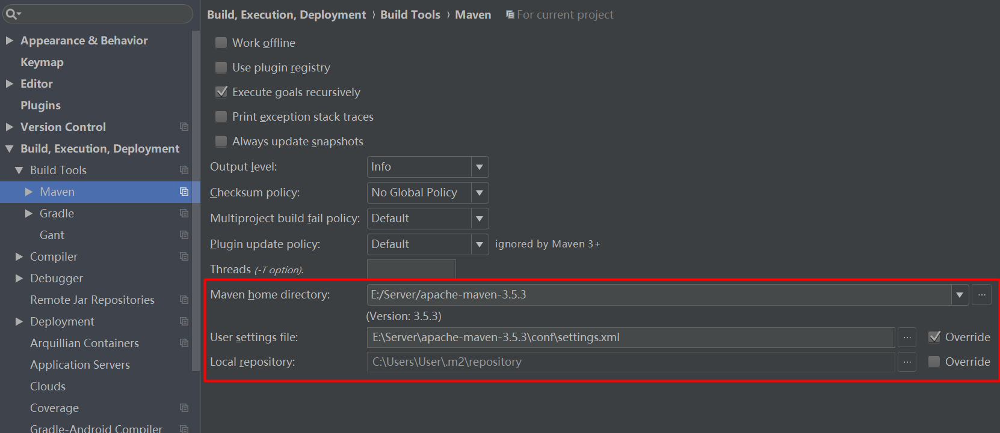
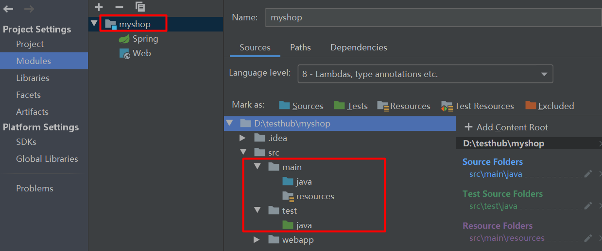
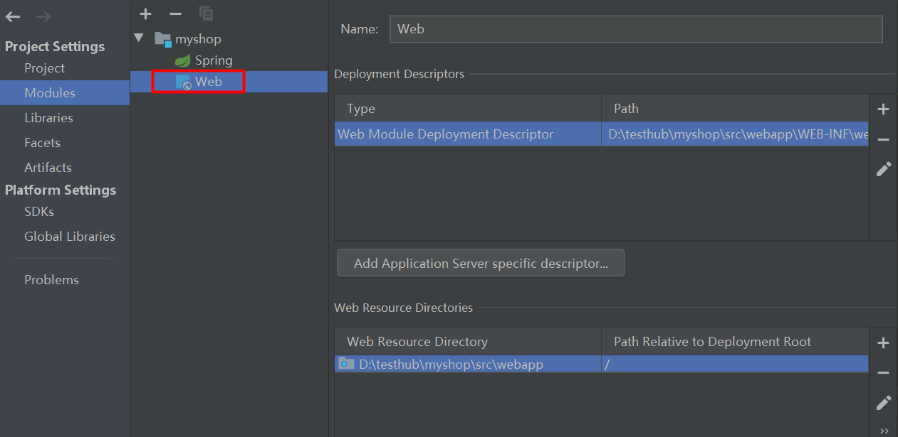
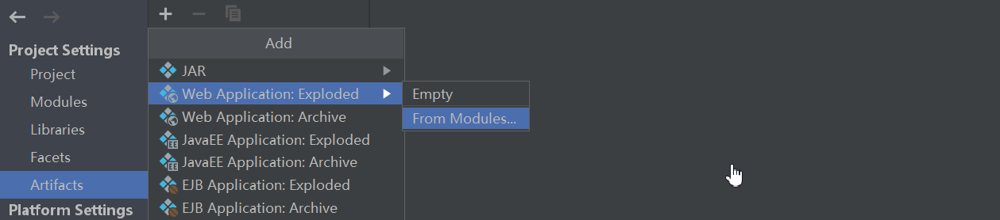
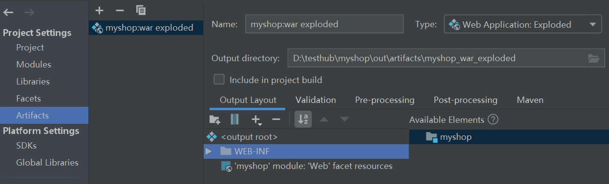
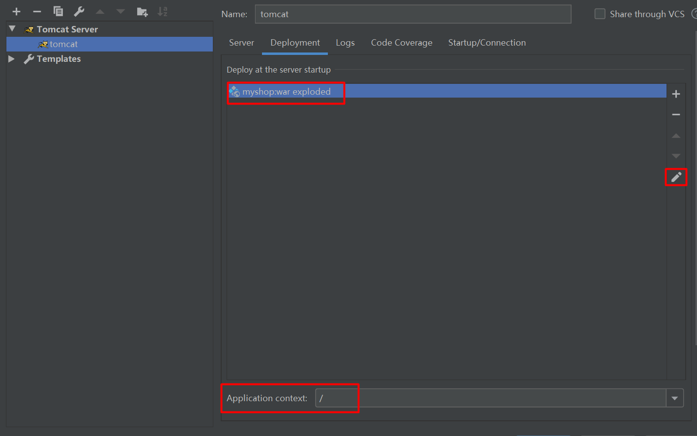

# 走进单体地狱

​	　单体应用的学习中会掌握 Intellij IDEA、Maven、Bootstrap、Spring、Spring MVC、MyBatis、HttpClient 等**工具**与**框架**的使用，并开始引入架构的概念，为“微服务架构”阶段打下坚实的基础。

> **Ref**：[讲义](https://www.funtl.com/zh/guide/%E8%B5%B0%E5%90%91%E5%8D%95%E4%BD%93%E5%9C%B0%E7%8B%B1.html) | [视频合辑](https://www.bilibili.com/video/av29299488) 


**实战：**

- [MyShop项目实战](../bin/myshop.md)


## 一 集成开发工具

### 1 Intellij IDEA

​	　IDEA 全称 IntelliJ IDEA，是互联网公司主流的 Java 集成开发环境，在智能代码助手、代码自动提示、重构、J2EE 支持、各类版本同步工具(`git`、`svn`、`github`等)、JUnit、CVS 整合、代码分析、 创新的 GUI 设计等方面的功能拥有着卓越的效率。

#### 1.1 IDEA Setting

​	　IDEA中的环境配置有`Setting`和`Default Setting`，两种配置项相同，只是作用范围不同。Setting用于特定的项目中，Default Setting是共用的配置。

**（1） 快捷键**

```
[代码编辑]
- ctrl + w：智能选取，实现选取范围的不断扩充
- crtl + alt + l：代码格式化
- shift + alt + insert：列编辑
- 双击选中 -> shift + F6 ：批量修改

[自动生成代码]
- alt + insert：自动代码生成
- psvm + enter: 快捷生成main代码
- sout + enter: 快捷生成System.out.println();
- .val : 快捷生成变量名
- div.container + tab : 自动生成div标签

[常用功能]
- ctrl + e： 显示最近打开过的文件
- ctrl + n： 显示类名查找框
- ctrl + q： 显示 JavaDoc 的结果
- ctrl + shift + r：全局搜索
- F2：定位下一个有问题的地方

[编译运行]
- ctrl + F9: build
- shift + F9: debug
- alt + f8: 查看debug中的变量值
```

 

**（2）Plugins**

​	　在`File` -> `Plugins`中下载如下IDEA插件，有助于提升开发效率。

```
MyBatis Log Plugin 				  将Mybatis执行的sql脚本显示出来
MybatisCodeHeplerPro 	          让你的mybatis.xml像java代码一样编辑
Lombok Plugin				      代码注解插件
Alibaba Java Coding Guidelines    阿里巴巴 Java代码规范插件
jclasslib bytecode viewer 	      可视化的字节码查看插件
```


#### 1.2 构建Maven项目

##### 1.2.1 导入Maven项目

​	　在`File` -> `New Project`中选择`Maven`，然后根据提示就可以**新建Maven项目** 或者 通过  `FILE` -> `import Setting`导入一个**已经存在的Maven项目**。

```text
// Maven项目的目录
----target：可执行的CLASS文件
----src：源码目录
--------main
-------------java：Java代码
-------------------Application.java:启动类
-------------resources：资源目录
-------------------application.properties:配置文件
--------test
-------------java：测试用例
----pom.xml：pom配置文件
----.gitignore：git忽略名单
----工程名.iml
```

​	　接着，在IDEA中配置Maven（建议配置在`Default Setting`中），需要**配置Maven主目录**、**勾选Override重置setting文件目录**、**勾选Override重置本地仓库**目录三步。



​	　最后，配置完成后，还需要点击IDEA右侧`Maven Projects`，刷新Pom来**导入项目依赖**。至此，一个Maven项目就已经建立成功了。


##### 1.2.2 Project Struct

**（1）Project SDK**

​	　选择 `File` -> `Project Structure`，在弹出的窗口中，设定**JDK 的安装路径**以及**项目语言级别**。


**（2）Modules**

​	　需要将项目中目录`Mark As`不同的含义，`Sources`表示代码、`Resources`表示资源目录、`Test`表示测试用例、`Test Resources`表示测试资源、`Excluded`表是编译目录。

**① 标记文件目录**




**② 设置Web Resource Directory**

​	　对于**Servlet项目**或者**前后端未分离**的项目，资源是部署在`webapp`目录下的，此时，还需要点击`myshop`下的`Web`，在`Deployment Descriptors`中配置 `web.xml` 的位置 和 在`Web Resource Directories`中配置webapp资源目录位置、资源部署的根目录为 `/`才能正常加载资源 。



**③ 配置Spring Context**

​	　若项目中包含`Spring`配置，还需要配置Spring的xml配置文件的位置。


**（3） Artifacts**

​	　对于需要部署到Tomcat的项目，还需要`Web Application`。首先需要在`Artifacts`中点击 `+`  号，选择`Web Application:Exploded`，然后选择`Form Modules` ，在弹出的窗口中选择当前项目`myshop`即可。



​	　新建完成后，可以得到如下图的配置结果，接着在Tomcat的`Deployment`中就可以配置`Artifacts`了。



##### 1.2.3 Tomcat部署

**（1）配置Server**

​	　对于需要部署在Tomcat中的项目，还需要配置Tomcat运行环境。首先在IDEA的顶部工具栏中选择 `Run` -> `Edit Configurations`，然后在弹出页面的左上方选择 `+` 号 -> `Tomcat Server` -> `Local`，最后填写Tomcat的名称、配置自动更新、选择 Tomcat 的安装、发布路径。


​	　选择`Update class and resources` 是采用**热部署**的方式启动Tomcat，可以让在**变更java文件**或者**web资源**时，无需重启Tomcat。但是要注意新增java文件或者资源是不能生效的。


**（2）配置Deployment**

​	　继续上一步，选择 [Deployment] ->[+] 号 ->[Artifact]后，点击[apply]保存配置，完成 Tomcat 本地部署



​	　`artifact:war exploded`表示项目以**虚拟化目录**（即将 `/projectName` -> `Application context自定义的路径 / 上`）的形式发布到Web服务器上，如以上的配置通过<a>http://localhost:8080/</a>即可访问项目。而`artifact:war`是以真实目录进行发布的，发布路径是`/projectName`，不建议使用`artifact:war`进行部署。

::: tip 注意
若点击[+] 号后，没有exploded的Artifact，需要在Project Structure的Artifacts中进行配置
:::


### 2 Maven

​	　 Maven由Apache公司采用Java语言编写，是一个**项目管理和综合工具**，提供了可以构建一个完整的**生命周期**框架。Maven 使用**标准的目录结构**和**默认构建生命周期**，**简化**和**标准化**项目**自动构建过程**，增加`可重用性`并负责建立相关的任务，使编译、分配、文档、团队协作和其他任务可以无缝连接。

#### 2.1 快速开始

::: warning 环境准备
确保JDK 为1.8 及以上版本，并已设置JAVA_HOME 环境变量
:::

​	　 首先在[maven官网](https://maven.apache.org/download.cgi)下载 Maven 的 zip 文件，然后解压到安装目录后，在`config/settings.xml`配置文件中修改`localRepository`标签值(可选)，来自定义Maven本地仓库路径。

```xml
 <localRepository>F:/Reference/mave/Respository</localRepository>
```

​	　 最后，在环境变量中新增`MAVEN_HOME`值为Maven安装路口（如：E:\Server\apache-maven-3.5.3），然后**追加**`%MAVEN_HOME%\bin`到`path`中即可。配置完成后，可以在cmd中运行`mvn -version`命令验证是否已经安装成功。

```
C:\Users\User>mvn -version
Apache Maven 3.5.3 (3383c37e1f9eff9f295297; 2018-02-25T03:49:05+08:00)
Maven home: E:\Server\apache-maven-3.5.3\bin\..
Java version: 1.8.0_161, vendor: Oracle Corporation
Java home: E:\JDK\JDK8\jre
Default locale: zh_CN, platform encoding: GBK
OS name: "windows 10", version: "10.0", arch: "amd64", family: "windows"
```


#### 2.2 依赖机制

​	　 Maven在**依赖机制**的帮助下会根据`pom.xml` 文件中的`坐标信息`，在`maven仓库`中自动下载、更新所有必需的依赖库，并保持版本升级。

##### 2.2.1 POM对象

​	　POM（**项目对象模型**）位于**项目的基本目录**中，是 Maven 工作的**基本单位**。每个项目只有**一个** POM 文件，POM以XML方式配置目标、插件等信息，Maven 会根据项目的POM文件获取所需要的配置信息。

​	　POM的根元素是[**project**]，由`groupId`**，**`artifactId`和`version`三个主要节点（必填）组成，这三个属性是项目仓库的唯一标识，项目在仓库中的项目符号由`groupId:artifactId:version`表示。 

- groupId：由`公司域名反转.项目组名称` 组成，全球唯一
- artifactId：表示唯一的项目名称
- version：表示项目版本号，用于将不同的版本彼此分离

```xml
<!--pom.xml 基本构成-->
<project xmlns="http://maven.apache.org/POM/4.0.0"
   xmlns:xsi="http://www.w3.org/2001/XMLSchema-instance"
   xsi:schemaLocation="http://maven.apache.org/POM/4.0.0
   http://maven.apache.org/xsd/maven-4.0.0.xsd">
   
   <modelVersion>4.0.0</modelVersion>
   <groupId>com.company.group</groupId>
   <artifactId>test</artifactId>
   <version>1.0.0</version>
  
<project>
```

​	　此外，POM的根元素是[**project**]下还有`packaging`（打包格式）、`name`（表示项目名称）、`description`（项目描述信息）、`dependencies`（项目依赖配置）和`properties` (自定义属性)等节点信息。

```xml
<packaging>war</packaging>
<name>transport</name>
<description>运输系统</description>
```

​	　　`dependencies`节点是项目依赖配置，整个项目生命周期中所需的依赖都在这里配置。`dependency`中`jar`包坐标由`groupId`、`artifactId`、`version`组成，如下所示：

```xml
<dependencies>
    <dependency>
        <groupId>de.codecentric</groupId>
        <artifactId>spring-boot-admin-starter-client</artifactId>
        <version>${spring-boot.version}</version>
    </dependency>
</dependencies>
```

​	　`properties` 节点可以配置**自定义属性**，通过`${spring-boot.version}`可以在version中灵活的指定各个关联jar包的版本。

```xml
<properties>
    <project.build.sourceEncoding>utf-8</project.build.sourceEncoding>
    <jdk.version>1.8</jdk.version>
    <spring-boot.version>1.8</spring-boot.version>
</properties>
```


##### 2.2.2 语义化版本

​	　Java版本号常使用**语义化版本规范**或者**逢十进一**的方式，建议使用语义化版本规范。如初始版本号为`1.0.0` ，接下来版本命名方式如下：

```text
1.0.1 在第一个版本上修复BUG
1.1.0 在第一个版本上新增功能
2.0.0 结构发生变更
```

​	　在使用**版本**时，如果 Maven 下载所提到的版本为 `data-service:1.0`，那么它永远不会尝试在库中下载已经更新的版本 1.0。要下载更新的代码，data-service 的版本**必须要升级到 1.1**。这样需要数据服务团在发布更新时每次都要告诉应用程序 UI 团队，请UI 团队更新一下 `pom.xml` 以获得更新应用的版本。为了处理这类情况，引入快照的概念。

​	　Maven版本与发行版和快照版两种。 **发行版**是**稳定的版本**，类和方法在命名、参数列表、功能上不会发生变更。**快照（SNAPSHOT）**是一个**特殊版本**，指出**目前开发拷贝**，快照不同于常规版本，Maven会在数据服务团队发布代码后更新快照存储库，使用新生成的快照来替换旧的快照。在使用快照时，Maven 会**自动获取最新的快照版本**。

```text
# 发行版
1.0.0-RELEASE
# 快照版(SNAPSHOT指代最新的快照版本号)
1.0.1-SNAPSHOT  -> 编译后动态生成后缀 1.0.1-20190310676786867
```


##### 2.2.3 Maven仓库

​	　 Maven 的本地仓库是用来存储所有项目的依赖关系(插件 Jar 和其他文件)，Maven首先从**本地Maven仓库**获取依赖，如果没有找到，会从[Maven中央存储库](http://repo1.maven.org/maven2/) 查找下载到本地仓库中。此外，如果在 pom.xml 中定义了远程仓库，最后还会在 **Maven 远程仓库**搜索。

::: tip 提示
可以使用 [MVNrepository](https://mvnrepository.com/) 查询Maven中央仓库中包含的依赖
:::


#### 2.3 Maven命令


##### 2.3.1 Plugins

​	　Maven插件分为 **构建插件** 和 **报告插件** 两种类型插件。构建插件是在**生成过程中执行**，报告插件在**网站生成期间执行**。Maven插件首先需要在 `pom.xml` 中的 元素进行配置，才能使用。

​	　Maven 是一个**执行插件**的框架，每一个任务实际上是由插件完成的。一个Maven插件通常提供了一组目标，可使用以下语法来执行：

```
mvn [plugin-name]:[goal-name]
```

​	　Maven 插件通常用于创建 jar 文件、创建 war文件、编译代码文件、进行代码单元测试、创建项目文档、创建项目报告。Maven常用命令如下：

```
mvn clean：调用maven-clean-plugin，删除根目录下target目录
mvn compile：调用maven-compile-plugin编译源码到target目录下
mvn compiler:compile ：编译目标
mvn test：执行src/test/java目录下类名为*Test.java的单元测试类
mvn package：打包根目录下的目录，web project打成war包，java project打成jar包
mvn install：打包到本地仓库，解决本地多个项目公用一个jar包的问题
mvn -dmaven.test.skip=true：只打包不测试（跳过测试）
mvn source:jar或mvn source:jar-no-fork：源码打包
mvn tomcat:run	通过maven命令将web项目发布到Tomcat
```


##### 2.3.2 LifeCycle

​	　 maven在项目构建中存在`cleanLifeCycle`（清理生命周期）、`defaultLifeCycle`（默认生命周期)、`siteLifeCycle`（站点生命周期）三类生命周期，这三类生命周期间相互独立、互不影响，在一类生命周期之内，执行后面的命令前面的操作会自动执行。

```
- defaultLifeCycle：是默认生命周期，包含compile、test、package、install、deploy四个节点
- siteLifeCycle：用于生成描述项目的javadoc文档。
```


## 二 前端框架

### 1 BootStrap

​	　Bootstrap是由Twitter开发的一个 `CSS/HTML` 框架。Bootstrap 不仅提供**网格系统**布局，还提供了**移动设备优先**、**响应式设计**的 CSS 样式，使Bootstrap 能够**自适应**于台式机、平板电脑和手机。

**参考资料：**

- [BootStrap中文网](https://www.bootcss.com/)
- [Bootstrap | 菜鸟教程](https://www.runoob.com/bootstrap/bootstrap-tutorial.html)
- [BootCdn资源](https://www.bootcdn.cn/)


#### 1.1 快速入门

​	　首先在[BootStrap官网](https://v3.bootcss.com/getting-started/#download)上下载Bootstrap 的**已编译版本**和在[JQuery官网](https://jquery.com/download/)下载JQuery**已编译版本**。由于Bootstrap4及以上不支持IE8，最低支持IE9，考虑到国内行情，我们下载`bootstrap-3.3.7`版本以支持IE8。

​	　接着，将下载好的预编译的`bootstrap `和`jquery-3.3.1.min.js`放入到`asserts`目录下的`plugins`中，其中CSS和JS目录存放的是**已编译**的CSS和JS（`bootstrap.*`）*以及**已编译压缩**的CSS和JS*（`bootstrap.min.*`）； font目录里面存放的是Glyphicons 字体图标(`.ttf`微软字体、`.woff`苹果字体)，这是一个可选的 Bootstrap 主题。

```html
BootStrap
------asserts
---------css			css目录
---------images			图片目录
---------js				js目录
---------plugins
------------bootstrap            下载的BootStrap文件
------------jquery-3.3.1.min.js  下载的JQuey文件
------helloWord.html	欢迎页
```

​	　最后，在`helloWord.html`中引入 `jquery.js`、`bootstrap.min.js` 和 `bootstrap.min.css` 文件，用于让一个**常规的 HTML 文件变为使用了 Bootstrap 的模板**。
::: tip 提示
也可通过[CDN](https://www.bootcdn.cn/)(内容分发网络)加载线上的bootstrap与jquery已编译文件
:::

​	　至此，BootStrap已经安装完毕，通过`Chrome`打开，即可看到带有浏览器中带BootStrap主题的`HelloWord`字样。

```html
<!DOCTYPE html>
<html>
<head>
    <meta charset="UTF-8">
    <title>Bootstrap 模板</title>
    <!-- meta自适应屏幕:缩小浏览器宽、高时，里面的元素会自动适应屏幕排列显示-->
    <meta name="viewport" content="width=device-width, initial-scale=1.0">
    <!-- 引入 Bootstrap -->
    <link href="assets/plugins/bootstrap/css/bootstrap.min.css" rel="stylesheet">
    <link href="assets/plugins/bootstrap/css/bootstrap-theme.min.css"
          type="text/css" rel="stylesheet">

    <!-- HTML5 Shiv 和 Respond.js 用于让 低于IE9的(IE8) 支持 HTML5元素和媒体查询 -->
    <!-- 注意： 如果通过 file://  引入 Respond.js 文件，则该文件无法起效果 -->
    <!--[if lt IE 9]>
    <script src="https://oss.maxcdn.com/libs/html5shiv/3.7.0/html5shiv.js">
    </script>
    <script src="https://oss.maxcdn.com/libs/respond.js/1.3.0/respond.min.js">
    </script>
    <![endif]-->
</head>
<body>
    <h1>Hello world!</h1>

    <!-- jQuery (Bootstrap 的 JavaScript 插件需要引入 jQuery) -->
    <script src="assets/plugins/jquery-3.3.1.min.js"></script>
    <!-- 包括所有已编译的插件 -->
    <script src="assets/plugins/bootstrap/js/bootstrap.min.js"></script>
</body>
</html>
```

> 说明 ： `<!--[if lt IE 9]><![endif]-->`这个不是注释


#### 1.2   网格系统

​	　在传统的网页布局方式中，`table 表格布局`可以快速的定位元素位置，但是必须表格里的内容全部加载完才能显示，不利于用户体验。 `div+css布局`解决了**从上至下、按需加载**的问题，但是不利于编写复杂页面。

​	　Bootstrap 包含了一个**响应式**的、**移动设备优先**的、不固定的**流式网格系统**（Grid System）。`网格`既可以用于组织内容，又可以**让网站易于浏览，并降低用户端的负载**，是一种用于快速创建一致的布局和有效地使用 HTML 和 CSS 的方法。


##### 1.2.1 移动设备优先

​	　Bootstrap 采用**移动设备优先**策略，布局使用**渐进增强、向上兼容**的方式，从小屏幕设备（比如移动设备、平板电脑）开始，然后扩展到大屏幕设备（比如笔记本电脑、台式电脑）上的**组件**和**网格**。

::: warning 设备布局兼容方式

① 渐进增强，向上兼容：先完整的加载内容，再根据内核版本，逐层增强特效

② 优雅降级，向下兼容：先满足最新的浏览器需求，在逐层降低

:::

**（1）优先展示内容**

​	　Bootstrap 优先展示内容，在保障内容可以正确显示的情况下，再根据**浏览器对Bootstrap 样式的支持情况**，引入所需的样式进行展示。

**（2）优先设计更小的宽度**

​	　Bootstrap 基础的 CSS 是移动设备优先，**媒体查询** 是针对于平板电脑、台式电脑设计的。

**（3）随着屏幕大小的增加而添加元素**

​	　响应式网格系统随着`屏幕`或`视口`（viewport）尺寸的增加，系统会自动分为**最多 12 列**，但是可以少于12列的。


##### 1.2.2 网格系统布局

​	　网格系统不仅包含了用于**简单的布局选项**的`预定义类`，还包含了用于生成更多语义布局的功能强大的`LESS混合类`。

**（1）基本的网格结构**

​	　网格系统通过一系列**包含内容的行和列**来创建页面布局，通常使用`行`来创建列的水平组，行必须放置在 `.container` class 内，以便获得适当的对齐（alignment）和内边距（padding），否则将占据页面一整行。`内容`应该放置在`列`内，且唯有列可以是行的直接子元素。

```html
<div class="container">
    <!-- 支持在台式电脑中展示两个相等的列的布局 -->
    <div class="row">
        <div class="col-md-6" style="border: 1px solid red">左 </div>
        <div class="col-md-6" style="border: 1px solid red">右 </div>
    </div>
    <!-- 支持在台式电脑中展示两个不相等的列的布局 -->
    <div class="row">
        <div class="col-md-6" style="border: 1px solid yellow">左 </div>
        <div class="col-md-4" style="border: 1px solid yellow">右 </div>
    </div>
</div>
```

​	　Bootstrap可以针对**不同的设备**自适应支持**相同的样式**，如下代码支持在台式电脑(`col-md-`)和手机(`col-xs-`)中展示两个相等的列的布局。

```html
<div class="container">
    <div class="row">
        <div class="col-md-6 col-xs-6" style="border: 1px solid red">左 </div>
        <div class="col-md-6 col-xs-6" style="border: 1px solid red">右 </div>
    </div>
</div>
```


**（2）网格选项**

​	　Bootstrap 支持的屏幕设备有手机、笔记本电脑、台式电脑等，可以配合简单的布局选项的`预定义类` 和 `媒体查询`，展示自定义样式。下表总结了 Bootstrap 网格系统如何跨多个设备工作：

| 说明         | 超小设备手机（< 768px）       | 小型设备平板电脑（≥ 768px）   | 中型设备台式电脑（≥ 992px）   | 大型设备台式电脑（≥ 1200px）  |
| ------------ | ----------------------------- | ----------------------------- | ----------------------------- | ----------------------------- |
| 网格行为     | 一直是水平的                  | 以折叠开始，断点以上是水平的  | 以折叠开始，断点以上是水平的  | 以折叠开始，断点以上是水平的  |
| 最大容器宽度 | None (auto)                   | 750px                         | 970px                         | 1170px                        |
| Class 前缀   | `.col-xs-`                    | `.col-sm-`                    | `.col-md-`                    | `.col-lg-`                    |
| 列数量和     | 12                            | 12                            | 12                            | 12                            |
| 最大列宽     | Auto                          | 60px                          | 78px                          | 95px                          |
| 间隙宽度     | 30px（一个列的每边分别 15px） | 30px（一个列的每边分别 15px） | 30px（一个列的每边分别 15px） | 30px（一个列的每边分别 15px） |


##### 1.2.3 媒体查询

​	　Bootstrap中`@media`媒体查询能在**不同的条件**下使用**不同的样式**，使页面在**不同在终端设备**下达到**不同的渲染效果**。

```css
@media 媒体类型 and (媒体特性) {你的样式}
```

**（1）媒体类型与特性**

​	　媒体类型在 CSS2 中是一个常见属性，可以通过**媒体类型**对不同设备**指定不同样式**。**Screen**、**All**、**Print** 为最常见的三种媒体类型。

```
- ALL：所有设备
- Braille：盲人用点子法触觉回馈设备
- Embossed：盲文打印机
- Handheld：便携设备
- Print：打印用纸或打印预览视图
- Projection：各种投影设备
- Screen：电脑显示器
- Speech：语音或音频合成器
- Tv：电视机类型设备
- Tty：使用固定密度字母栅格的媒介，比如电传打字机和终端
```

​	　媒体查询中的大部分接受 `min/max` 前缀，用来表达其逻辑关系，表示应用大于等于或小于等于某个值的情况。没有特殊说明都支持 `min/max`。

```
- width：Length 渲染界面的宽度
- height：Length 渲染界面的高度
- color：整数，表示色彩的字节数
- color-index：整数， 色彩表中的色彩数
- device-aspct-ratio：整数/整数，宽高比例
- device-height：Length 设备屏幕的输出高度
- device-width：Length 设备屏幕的输出宽度
- grid（不支持 `min/max` 前缀）：整数，是否基于栅格的设备
- monochrome：整数，单色帧缓冲器中每像素字节数
- resolution：分辨率（dpi/dpcm）分辨率
- scan（不支持 `min/max` 前缀）：Progressive interlaced，Tv 媒体类型的扫描方式
- orientation（不支持 `min/max` 前缀）：Portrait//landscape 横屏或竖屏
```


**（2） 使用媒体查询**

① 最大宽度

​	　`max-width` 是媒体特性中最常用的一个特性，其意思是指媒体类型小于或等于指定的宽度时，样式生效。如：

```css
<!--当屏幕小于或等于 480px 时，页面中包含类样式 `.ads` 的元素都将被隐藏-->
@media screen and (max-width:480px) {
 .ads {
   display:none;
  }
}
```

②  最小宽度

​	　`min-width` 与 `max-width` 相反，指的是媒体类型大于或等于指定宽度时，样式生效。

```css
<!--当屏幕大于或等于 900px 时，页面中包含类样式 `.wrapper` 元素的宽度为 980px。-->
@media screen and (min-width: 900px) {
    .wrapper {width: 980px;}
}
```


**（3）多个媒体特性的使用**

​	　媒体查询可以使用关键词 `and` 将多个媒体特性结合在一起。也就是说，一个媒体查询中可以包含 0 到多个表达式，表达式又可以包含 0 到多个关键字，以及一种媒体类型。

```css
<!--当屏幕在 600px~900px 之间时，`body` 的背景色渲染为 `#F5F5F5` ，如下所示：-->
@media screen and (min-width:600px) and (max-width:900px) {
  body {background-color:#F5F5F5;}
}
```


> 备注：CSS引入的优先级采用**就近原则**，依次是行内样式、内联样式、外联样式，`@import`可以强制将样式生效。


#### 1.3  布局组件

##### 1.3.1 表格

**（1）表格元素**

​	　Bootstrap 提供了一个清晰的创建表格的布局。下表列出了 Bootstrap 支持的一些表格元素：

| 标签        | 描述                                                         |
| ----------- | ------------------------------------------------------------ |
| `<table>`   | 为表格添加基础样式                                           |
| `<thead>`   | 表格标题行的容器元素（`<tr>`），用来标识表格列               |
| `<tbody>`   | 表格主体中的表格行的容器元素（`<tr>`）                       |
| `<tr>`      | 一组出现在单行上的表格单元格的容器元素（`<td>` 或 `<th>`）   |
| `<td>`      | 默认的表格单元格                                             |
| `<th>`      | 特殊的表格单元格，用来标识列或行（取决于范围和位置）。必须在 `<thead>` 内使用 |
| `<caption>` | 关于表格存储内容的描述或总结                                 |

> 说明：书写表格的时候一定采用包含`<thead>`和`<tbody>`的标准的表格，才能使插件生效


**（2） 基本的表格**

​	　如果您想要一个只带有内边距（padding）和水平分割的基本表格，请添加 class样式 `.table`即可。如下面实例所示：

```html
<div class="container">
    <table class="table">
        <caption>基本的表格布局</caption>
        <thead>
        <tr>
            <th>名称</th>
            <th>城市</th>
        </tr>
        </thead>
        <tbody>
        <tr>
            <td>Tanmay</td>
            <td>Bangalore</td>
        </tr>
        <tr>
            <td>Sachin</td>
            <td>Mumbai</td>
        </tr>
        </tbody>
    </table>
</div>
```


**（3）表格样式**

​	　除了 `.table`基本表格样式，BootStrap还提供了各式各样的用于**表格**、**行**或者**单元格**的样式，具体样式如下所示：

**① 下表样式可用于表格中**

| 类                 | 描述                                              |
| ------------------ | ------------------------------------------------- |
| `.table`           | 为任意 `<table>` 添加基本样式 (只有横向分隔线)    |
| `.table-striped`   | 在 `<tbody>` 内添加斑马线形式的条纹 ( IE8 不支持) |
| `.table-bordered`  | 为所有表格的单元格添加边框                        |
| `.table-hover`     | 在 `<tbody>` 内的任一行启用鼠标悬停状态           |
| `.table-condensed` | 让表格更加紧凑                                    |

**② 下表的类可用于表格的行或者单元格**

| 类         | 描述                             |
| ---------- | -------------------------------- |
| `.active`  | 将悬停的颜色应用在行或者单元格上 |
| `.success` | 表示成功的操作                   |
| `.info`    | 表示信息变化的操作               |
| `.warning` | 表示一个警告的操作               |
| `.danger`  | 表示一个危险的操作               |


##### 1.3.2 字体图标

​	　字体图标是使用**字体格式**的字形做成了图标。Bootstrap 捆绑了 200 多种字体格式的字形，在 fonts 文件夹内可以找到字体图标。除此之外，还可以使用如下其它字体图标库：

- [阿里巴巴矢量图标库](http://www.iconfont.cn/)

- [SocialIcons](http://www.socicon.com/chart.php)

- [LineAwesome](https://icons8.com/line-awesome)

- [FontAwesome](http://fontawesome.dashgame.com/)


​	　字体图标是矢量图标，用于形象展示功能的含义，增强用户体验，放大和缩写都不会使字体图标失真。字体图标分为**线性图标**和**填充图标**。

```css
<span class="glyphicon glyphicon-search"></span>
```


### 2 JSP页面


## 三 后端框架

### 1  MVC与三层架构

**参考资料：**

- [使用Servlet实现简单的登录功能](../demo/使用Servlet实现简单的登录功能.md)


#### 1.1 三层架构

​	　**三层架构**是视图层 `View`、服务层 `Service`，与持久层 `DAO`。它们分别完成不同的功能。**View 层**用于接收用户提交请求的代码，系统的业务逻辑主要在**Service 层**完成，**DAO 层**直接操作数据库的代码。


​	　为了更好的降低各层间的耦合度，在三层架构程序设计中，采用**面向抽象编程**。即上层对下层的调用，是通过接口实现的。而下层对上层的真正服务提供者，是下层接口的实现类。服务标准（接口）是相同的，服务提供者（实现类）可以更换。这就实现了**层间解耦合**。是相同的，服务提供者（实现类）可以更换。这就实现了**层间解耦合**。


#### 1.2 MVC模式

​	　**MVC**即 Model模型、View视图，及 Controller控制器。`View`为用户提供使用界面，与用户直接进行交互。`Model`用于承载数据，并对用户提交请求进行计算的模块。其分为两类，一类称为**数据承载 Bean (DAO)**，一类称为**业务处理 Bean (Service)**。所谓数据承载 Bean 是指实体类，专门用户承载业务数据的，如 Student、User 等。而业务处理 Bean 则是指 Service 或 Dao 对象， 专门用于处理用户提交请求的。`Controller`用于将用户请求转发给相应的 Model 进行处理，并根据 Model 的计算结果向用户提供相应响应。


#### 1.3 三层架构 + MVC

​	　`三层架构`与`MVC`这两种结构既有区别，又有联系。但这两种结构的使用，均是为了**降低系统模块间的耦合度**，将将业务与展示分离。


### 2 Spring

​	　Spring 是一个分层的 `Java SE/EE full-stack`(一站式)轻量级开源框架，主要作用就是降低企业应用开发的复杂性（**解耦**）。Spring 的核心是**控制反转**（`IoC`）和**面向切面编程**（`AOP`）。

**参考资料：**

- [第一个Spring应用程序](../demo/第一个Spring应用程序.md)


#### 2.1 Spring特性

​	　Spring具有非侵入式的特性，Spring 框架的 API 不会在业务逻辑上出现，即业务逻辑是 POJO。由于业务逻辑中没有 Spring 的 API，所以业务逻辑可以从 Spring 框架快速的移植到其他框架， 即与环境无关。

​	　Spring 作为一个容器，可以管理对象的生命周期、对象与对象之间的依赖关系。可以通过配置文件，来定义对象，以及设置与其他对象的依赖关系。

**(1) 面向切面编程AOP**

​	　根据功能的不同，系统中的代码可以分为 **主业务逻辑** 与 **系统级业务逻辑** 两类。`主业务代码`间逻辑联系紧密，有具体的专业业务应用场景，复用性相对较低；`系统级业务`相对功能独立，没有具体的专业业务应用场景，主要是为主业务提供系统级服务，如日志、安全、事务、数据库连接等，**复用性强**。

```
如：JDBC来链接数据库：
	1、加载去掉（系统级业务逻辑）
	2、创建连接（系统级业务逻辑）
	3、开启事务（系统级业务逻辑）
	4、SQL操作 （主业务逻辑：银行业务、保险业务、电商业务、物流业务）
	5、提交事务（系统级业务逻辑）
	6、释放连接（系统级业务逻辑）
```

​	　我们可以把日志、安全、事务管理、数据库连接等服务理解成一个“**切面**”，那么以前这些服务一直是直接写在业务逻辑的代码当中的，这有两点不好：首先**业务逻辑不纯净**；其次这些服务被很多**业务逻辑反复使用**，完全可以剥离出来做到复用。 **AOP 可以把这些服务剥离出来形成一个“切面”**，然后将“切面”由 Spring 容器统一动态的“织入”到业务逻辑中，让业务逻辑能够享受到此“切面”的服务。

​	　**面向切面编程**（`AOP`，`Aspect Orient Programming`），是对面向对象编程思想 （`OOP`）的补充。Spring 提供了面向切面编程的丰富支持，允许通过分离应用的**业务逻辑**与**系统级服务**进行开发。**应用对象只完成业务逻辑**，并不负责系统级服务。


**(2) 控制反转IoC**

​	　**控制反转**（`IoC`，`Inversion of Control`）就是将**对象控制权**由`程序代码`**反转**到`外部容器`，创建被调用者的实例不是由调用者（程序代码）完成，而是由 `外部容器` 实现对对象的统一装配和管理。IoC 思想实现方式有 **依赖注入**和 **依赖查找** 两种。

​	　**依赖注入** (`Dependency Injection`，`DI`) 是指在对象初始化时不等对象请求，Spring容器就主动将依赖注入到调用者，**依赖注入是目前最优秀的解耦方式**。依赖注入让 Spring 的 Bean 之间以配置文件的方式组织在一起，而不是以硬编码的方式耦合在一起的。

​	　依赖查找（Dependency Lookup，DL），容器提供回调接口和上下文环境给组件，程序代码则需要提供具体的查找方式。比较典型的是依赖于 JNDI 系统的查找


**(3) 非侵入式**

​	　Spring具有非侵入式的特性，Spring 框架的 API 不会在业务逻辑上出现，即业务逻辑是 POJO。由于业务逻辑中没有 Spring 的 API，所以业务逻辑可以从 Spring 框架快速的移植到其他框架， 即与环境无关。


**(4) 容器**

​	　Spring 作为一个容器，可以管理对象的生命周期、对象与对象之间的依赖关系。可以通过配置文件，来定义对象，以及设置与其他对象的依赖关系。


#### 2.2 Spring体系架构

​	　Spring 由 20 多个模块组成，它们可以分为 数据访问/集成（Data Access/Integration）、Web、**面向切面编程**（AOP, Aspects）、应用服务器设备管理（Instrumentation）、消息发送（Messaging）、核心容器（Core Container）和测试（Test）。


### 3 SpringWeb

### 4 SpringMvc

### 5 Mybatis


## 四 Common工具

### 1 Junit单元测试

​	　JUnit 是用于编写和运行可重复的**自动化测试**的开源测试框架，这样可以保证我们的代码按预期工作。

**参考资料：**

- [第一个Junit单元测试](../demo/第一个Junit单元测试.md)


#### 1.1 TDD测试驱动

​	　`TDD`是**测试驱动**编程思想，提倡“**先编写测试用例，再完成编码**”，这样保证了代码质量，测试的覆盖率高，但是开发效率低。测试时**按照不同的场景**分为有单元测试、压力测试、疲劳强度测试、冒烟测试、集成测试、回归测试等。

```
单元测试：分为白盒测试、黑盒测试、灰盒测试
压力测试：专门用于测试应用最大可以承载多少并发
疲劳强度测试：测试程序能否长期（72时 ~ 7天）稳定运行
冒烟测试：对主要流程(支付环节)进行频繁、高强度的测试
集成测试：对完整功能的进行测，最重要的是测试整体业务流程
回归测试：若测试完后，应用又新增了一个功能或BugFix，需要针对这个功能或BugFix进行回归测试
```


#### 1.2 Junit注解

**（1）@Test**

​	　`@Test`注解表明该方法是一个测试方法。当想暂时禁用特定的测试方法执行时，可以使用`@Ignore`注解。

```java
@Test
public void testLog4j() {
    System.out.println("Hello Log4j");
}
@Ignore
public void ignoreLog4j() {
    System.out.println("Hello IgnoreLog4j");
}
```

**（2）@Before 和 @After**

​	　	`@Before` 和 `@After` 注解 表明该方法必须在类中**每个测试方法**执行 `之前/之后` 执行。

```java
@Before
public void before() {
    System.out.println("执行 before() 方法");
}
@After
public void after() {
    System.out.println("执行 after() 方法");
}
```


**（3）@BeforeClass和 @AfterClass**

​	　`@BeforeClass` 和 `@AfterClass`注解只能在**测试用例类执行** `之前/之后` 执行**一次,** 方法必须声明为`public static`。

```java
@BeforeClass
public void static beforeClass() {
    System.out.println("执行 beforeClass() 方法");
}
@AfterClass
public void static afterClass() {
    System.out.println("执行 afterClass() 方法");
}
```


#### 1.3 Junit断言

​	　断言是指在可以**断定程序中的某个特定点的布尔表达式值**为true，则继续运行，若为false，则**中断**当前操作的话，可以使用断言。一般在 **测试** 或 **出现BUG**时**启用断言**，而在**部署时禁用断言**。使用断言可以创建更稳定、品质更好且 不易于出错的代码。

（1） 断言两个值相等

```java
/**
 * 断言两个变量相等
 * message : 可选的字符串,自定义抛出异常信息
 * 入参类型：int, short, long, byte, char, Object
 * */
void assertEquals([String message], expected value, actual value2)；
```


（2）断言一个条件为真/假

```java
/**
 * 断言条件为真
 * message : 可选的字符串,自定义抛出异常信息
 * condition：需要断言的条件
 * */
void assertTrue([String message], boolean condition);

/**
 * 断言条件为假
 * message : 可选的字符串,自定义抛出异常信息
 * condition：需要断言的条件
 * */
void assertFalse([String message],boolean condition)
```


（3）断言一个对象是否为空

```java
/**
 * 断言一个对象不为空(null)
 * */
void assertNotNull([String message], java.lang.Object object);

/**
 * 断言一个对象为空(null)
 * */
void assertNull([String message], java.lang.Object object)
```


（4）断言两个对象是否引用相同的对象

```java
/**
 * 断言两个对象引用相同的对象
 * */
void assertSame([String message], java.lang.Object expected, java.lang.Object actual)
    
/**
 * 断言两个对象不是引用同一个对象
 * */
void assertNotSame([String message], java.lang.Object unexpected, java.lang.Object actual)
```


（5）断言预期数组和结果数组相等

```java
/**
 * 断言预期数组和结果数组相等
 * 数组的类型： int, long, short, char, byte, Object
 * */
void assertArrayEquals([String message], expectedArray, resultArray)
```


### 2 Log4j日志

​	　`Log4j` ( `Log for java`)是专门用于 Java 语言的日志记录工具。`Log4j`是通过**日志输出控制文件(**`log4j.properties`)来控制日志输出，代码中只要设置好**日志信息内容**及**日志级别**，即可在开发、测试、维护、运行等环节，向控制台或文件等位置输出**大量**日志信息。

**参考资料：**

- [第一个Log4j日志文件](../demo/第一个Log4j日志文件.md)


#### 2.1 log4j.properties

​	　日志属性文件包含**日志附加器**和**根日志**两个对象，主要由日志信息的输出`位置`、`格式`、`级别`这三部分组成。**输出位置**控制日志信息将要输出的位置是**控制台**还是**文件**等，日志信息的**输出格式**控制日志信息的显示格式，日志信息的**输出级别**控制要输出的**日志级别**。

**（1）根日志**

​	　根日志(`log4j.rootLogger`)是 Java 代码中的**日志记录器**，如可配置日志级别为 `INFO` 和 预定义了名称为 `console`、`file` 两种附加器。

```properties
log4j.rootLogger=INFO, console, file
```

**（2）日志附加器**

​	　日志附加器本质是一个接口，由**日志输出位置定义**，可以为日志记录器附加上很多其它设置信息，如输出布局、文件位置、文件大小等，定义语法为：

```properties
log4j.appender.appenderName = 输出位置
```


#### 2.2 日志附加器

**1、常用的附加器实现类**

（1）console 附加器

```properties
 # 日志输出到控制台
log4j.appender.console=org.apache.log4j.ConsoleAppender
```

（2）file 附加器

```properties
#日志输出到文件
log4j.appender.file=org.apache.log4j.FileAppender
#每天产生一个日志文件
log4j.appender.file=org.apache.log4j.DailyRollingFileAppender
#当日志文件大小到达指定大小时将产生一个新的日志文件
log4j.appender.file=org.apache.log4j.rolling.RollingFileAppender
```


**2、常用布局类型**

​	　布局类型分为简单布局、网页布局、匹配器布局。以`console`输出位置举例，如下展示了不同布局类型的引用方式。

```properties
# 网页布局，以 HTML 表格形式布局
log4j.appender.console.layout=org.apache.log4j.HTMLLayou
# 简单布局，包含日志信息的级别和信息字符串
log4j.appender.console.layout=org.apache.log4j.SimpleLayout
# 匹配器布局，可以通过ConversionPattern属性灵活地指定布局模式
log4j.appender.console.layout=org.apache.log4j.PatternLayout
log4j.appender.console.layout.ConversionPattern=%d %p [%c] - %m%n
```

​	　布局类型`org.apache.log4j.PatternLayout`是一种**匹配器布局**，可以通过设定 `ConversionPattern`属性值来控制具体输出格式的 。

```
%m：输出代码中指定的消息
%p：输出优先级，即 DEBUG，INFO，WARN，ERROR，FATAL
%r：输出自应用启动到输出该 log 信息耗费的毫秒数
%c：输出所属的类目，通常就是所在类的全名
%t：输出产生该日志事件的线程名
%n：输出一个回车换行符，Windows 平台为 /r/n，Unix 平台为 /n
%d：输出日志时间点的日期或时间,默认格式为ISO8601,可指定格式为%d{yyy MMM dd HH:mm:ss,SSS}
%l：输出日志事件的发生位置，包括类目名、发生的线程，以及在代码中的行数。
```


#### 2.3 使用Junit日志

**（1）设置日志级别**

​	　在调试、运维的过程中需要将必要的日志进行输出，但是**输出语句若在程序运行时全部执行**， 则势必会**降低运行效率**，所以对日志信息进行**分级管理**，将日志级别由高到低，共分 6 个级别：

```
- fatal(致命的)
- error
- warn
- info
- debug
- trace(线程级别日志)
```


**（2）日志信息内容**

​	　slf4j (`Simple Loging Facade For Java`) 是为 Java 程序提供**日志输出的统一接口**，slf4j须搭配其他具体的日志实现方案，比如 apache 的 `org.apache.log4j.Logger`、JDK 自带的 `java.util.logging.Logger` 或者 目前比较流行的是`Logback`框架。

```java
logger.info("slf4j message is : {}", "message");
```

​	　使用`{}` 占位符来打印日志，可以减少字符串拼接操作。类似于在使用`System.out.println()`打印日志时，使用`String.format()`中的`%s`作为占位符输出日志。

```java
String.format("meaasge is : %s %s",message1,message2);
```


### 3 Cache

### 4 HttpClient

