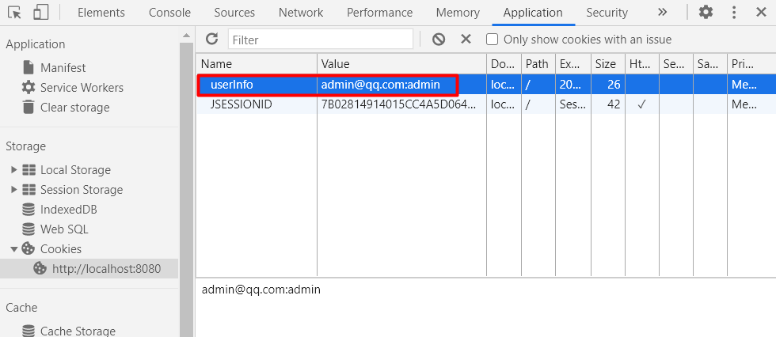
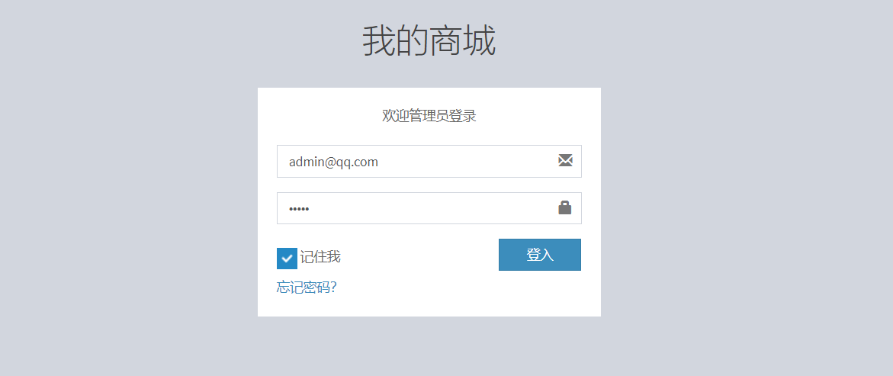

# 简单的登录功能

**目录：**

- v1.0 项目初始化

  - 新建Maven项目
  - 使用Servlet + JSP实现简单的登录功能
  - 编写测试用例

- v1.1 登录页面

  - 引入AdminLTE模板，重新登录页面
  - 登录页面加入错误信息提示
  - 采用SpringWeb装配Bean
  - 添加记住我的功能

- v1.2 

  -   ​


## v1.0 项目初始化

### 新建Maven项目

#### 目录结构

​	　在IDEA中选择`File` -> `New Project`中选择`Maven`，然后根据提示新建Maven项目，并完成如下文件结构的建立：

```text
src\main 目录
--java：Java代码
----com.shooter.funtl                           _
------common                 ---公共组件          |
------config                 ---配置模块          |-→ 代码目录
------module                 ---业务逻辑         _⌋
---------entiry                        ---数据实体
----------User.java
--------dao                            ---数据访问层
----------UserDao.java
----------impl
------------UserDaoImpl.java
--------service                        ---业务逻辑层
----------UserService.java
----------impl
------------UserServiceImpl.java
--------web                            ---前端控制层
----------controller
------------LoginController.java

--webapp： 视图层
----WEB-INF
------web.xml         ---请求路径映射
----index.jsp         ---登录页面
----fail.jsp          ---登录失败页面
----success.jsp       ---登录成功页面
```


#### 引入Jar包

```xml
<!--引入servlet包-->
<dependency>
    <groupId>javax.servlet</groupId>
    <artifactId>javax.servlet-api</artifactId>
    <version>4.0.1</version>
    <scope>provided</scope>
</dependency>

<!--引入lombok包-->
<dependency>
    <groupId>org.projectlombok</groupId>
    <artifactId>lombok</artifactId>
    <scope>provided</scope>
    <version>1.16.18</version>
</dependency>
```


### 编写业务代码

#### 数据模型

```java
@Data
public class User {
    private String userName;
    private String passWd;
    private String email;
}
```


#### 数据访问层

（1）UserDao

```java
public interface UserDao {
    User getUser(String email, String passWord);
}
```

（2）UserDaoImpl

```java
public class UserDaoImpl implements UserDao {
     public User getUser(String email, String passWord) {
        //先根据loginId查询出用户信息，再比对loginPwd
        //不可直接根据loginId和loginPwd直接查询，防止SQL注入
        if("admin@qq.com".equals(email)){
            if("admin".equals(passWord)){
                User user = new User();
                user.setEmail("admin@qq.com");
                user.setPassWd("admin");
                user.setUserName("admin");
                return user;
            }
        }
        return null;
    }
}
```


#### 业务逻辑层

（1）UserService

```java
public interface UserService {
    User login(String loginId, String loginPwd);
}
```

（2）UserServiceImpl

```java
public class UserServiceImpl implements UserService {
    private UserDao userDao = new UserDaoImpl();
    //调用数据访问层中login的实现
     public User login(String loginId, String loginPwd) {
        return userDao.getUser(loginId,loginPwd);
    }
}
```


#### 前端控制层

（1）LoginController

```java
public class LoginController extends HttpServlet {
    private UserService userService = new UserServiceImpl();
    @Override
    protected void doPost(HttpServletRequest req, HttpServletResponse resp) 
        			throws ServletException, IOException {
        //获取参数
        String loginId = req.getParameter("loginId");
        String loginPwd = req.getParameter("loginPwd");
		//验证用户名、密码是否正确
        User user = userService.login(loginId, loginPwd);
        //登录失败的处理
        if(user == null){
            req.getRequestDispatcher("/fail.jsp").forward(req,resp);
        }
        //登录成功的处理
        else {
            req.getRequestDispatcher("/success.jsp").forward(req,resp);
        }
    }
}
```


（2）配置web.xml

```xml
<?xml version="1.0" encoding="UTF-8"?>
<web-app xmlns="http://xmlns.jcp.org/xml/ns/javaee"
         xmlns:xsi="http://www.w3.org/2001/XMLSchema-instance"
         xsi:schemaLocation="http://xmlns.jcp.org/xml/ns/javaee 
         http://xmlns.jcp.org/xml/ns/javaee/web-app_4_0.xsd"
         version="4.0">
    <display-name>ssm-myshop</display-name>

    <servlet>
        <servlet-name>LoginController</servlet-name>
        <servlet-class>
            com.shooter.funtl.web.controller.LoginController
        </servlet-class>
    </servlet>
    <servlet-mapping>
        <servlet-name>LoginController</servlet-name>
        <url-pattern>/login</url-pattern>
    </servlet-mapping>
</web-app>
```

​	　**特别注意**：配置`web.xml`完成后，还需要再设置`Web Resource Directory`（参考[这里](https://sh086.github.io/funtl/guide/quickstart.html#project-struct)的`Modules`中的第(2)点）。


### 编写测试用例

#### 引入Jar包

```xml
 <!--Junit-->
     <dependency>
     <groupId>junit</groupId>
     <artifactId>junit</artifactId>
     <version>4.12</version>
 </dependency>
 <!--Log4j-->
<dependency>
    <groupId>org.slf4j</groupId>
    <artifactId>slf4j-api</artifactId>
    <version>1.7.25</version>
</dependency>
<dependency>
    <groupId>org.slf4j</groupId>
    <artifactId>slf4j-log4j12</artifactId>
    <version>1.7.25</version>
</dependency>
```

#### 编写代码

```java
import org.junit.Before;
import org.junit.Test;
import org.slf4j.Logger;
import org.slf4j.LoggerFactory;

public class JUnitLog4jTest {

    private static final Logger logger = LoggerFactory.getLogger(LoginController.class);

    private UserService userService;

    @Before
    public void testBefore(){
        userService = new UserServiceImpl();
    }

    @Test
    public void testUserService(){
        User user  = userService.login("admin@qq.com","admin");
        logger.info("用户：{}",user.getEmail());
    }
}
```


### JSP登录页面

#### 欢迎页面

​	　`index.jsp`是Servlet项目默认的欢迎页面，无需在`web.xml`中显示配置，项目部署成功后，访问根路径会直接跳转到`index.jsp`页面。

```html
<%@ page contentType="text/html;charset=UTF-8" language="java" %>
<html>
<head>
    <title>登录</title>
</head>
<body>
    <form action="/login" method="post">
        用户名：<input name="loginId" type="text"/><br/>
        密码：<input name="loginPwd" type="password"/><br/>
        <input type="submit" value="登录"/>
    </form>
</body>
</html>
```


#### 调转页面

​	　success.jsp 和 fail.jsp登录跳转页面，登录失败的页面和这个是一样的，这里略过。

```html
<%@ page contentType="text/html;charset=UTF-8" language="java" %>
<html>
<head>
    <title>登录</title>
</head>
<body>
    登录成功
</body>
</html>
```


### 测试运行

​	　最后，参考[Tomcat部署](https://sh086.github.io/funtl/guide/quickstart.html#tomcat%E9%83%A8%E7%BD%B2)笔记，完成Tomcat的项目配置后，即可打开浏览器访问 <a href ="http://localhost:8080" target="view_window"> http://localhost:8080</a>


## v1.1 登录页面

### 引入AdminLTE模板

​	　**AdminLTE**是一个基于BootStrap的管理模板，首先[下载](https://github.com/ColorlibHQ/AdminLTE/releases)`AdminLTE-2.4.18`版本，下载完成后解压文件，得到如下目录：

```
bower_components 浏览器组件(需引入到项目）
dist 源码
-----css(需引入到项目）
-----img(需引入到项目）
-----js (需引入到项目）
documentation 文档
pages demo 示例
plugins 插件(需引入到项目）
```

​	　接着在`webapp`目录下新建`assets`目录，然后将AdminLTE`需引入到项目`的5个目录，全部复制到项目的`assets`目录下，即可使用AdminLTE模板。

```
webapp/assets目录
--bower_components 浏览器组件
--css
--img
--js
--plugins 插件
```


### 编写业务代码

#### 登录页面

​	　接着，我们需要模仿AdminLTE中`pages\examples\login.html`页面，重写登录页面`index.jsp` ，特别注意，修改Google Font的地址请参考[这里](https://sb.sb/blog/css-cdn/)。此外，还加入了登录错误信息的展示，实现的方法有两种，具体方式如下：

（1）方法一 ： 通过修改style样式的方式实现

```html
<div class="alert alert-danger alert-dismissible"
     ${message == null ? "style='display:none'": ""}>
        <button type="button" class="close" 
                data-dismiss="alert" aria-hidden="true">&times;</button>
            ${message}
 </div>
```

（2）方法二：通过JSTL表达式实现

```xml
<!-- 第一步： 需要引入JSTL的Jar包 -->
<dependency>
    <groupId>javax.servlet</groupId>
    <artifactId>jstl</artifactId>
    <version>1.2</version>
</dependency>

<!-- 第二步： 需要在index.jsp的头部引入jstl表达式的支持。 -->
<%@ taglib uri="http://java.sun.com/jsp/jstl/core" prefix="c" %>
    
<!-- 第三步： 就可以使用JSTL表达式了 -->
<c:if test="${message != null}">
   <div class="alert alert-danger alert-dismissible">
       <button type="button" class="close" 
               data-dismiss="alert" aria-hidden="true">&times;</button>
           ${message}
     </div>
</c:if>
```


（3）具体实现代码如下：

```html
<%@ page contentType="text/html;charset=UTF-8" language="java" %>
<%@ taglib uri="http://java.sun.com/jsp/jstl/core" prefix="c" %>

<!DOCTYPE html>
<html>
<head>
    <meta charset="utf-8">
    <meta http-equiv="X-UA-Compatible" content="IE=edge">
    <title>我的商城 | 登录</title>
    <!-- Tell the browser to be responsive to screen width -->
    <meta content="width=device-width, initial-scale=1, maximum-scale=1, user-scalable=no" name="viewport">
    <!-- Bootstrap 3.3.7 -->
    <link rel="stylesheet" href="assets/bower_components/bootstrap/dist/css/bootstrap.min.css">
    <!-- Font Awesome -->
    <link rel="stylesheet" href="assets/bower_components/font-awesome/css/font-awesome.min.css">
    <!-- Ionicons -->
    <link rel="stylesheet" href="assets/bower_components/Ionicons/css/ionicons.min.css">
    <!-- Theme style -->
    <link rel="stylesheet" href="assets/css/AdminLTE.min.css">
    <!-- iCheck checkbox样式-->
    <link rel="stylesheet" href="assets/plugins/iCheck/square/blue.css">

    <!-- HTML5 Shim and Respond.js IE8 support of HTML5 elements and media queries -->
    <!-- WARNING: Respond.js doesn't work if you view the page via file:// -->
    <!--[if lt IE 9]>
    <script src="https://oss.maxcdn.com/html5shiv/3.7.3/html5shiv.min.js"></script>
    <script src="https://oss.maxcdn.com/respond/1.4.2/respond.min.js"></script>
    <![endif]-->

    <!-- Google Font -->
    <link rel="stylesheet" href="https://fonts.loli.net/css?family=Source+Sans+Pro:300,400,600,700,300italic,400italic,600italic">
</head>
<body class="hold-transition login-page">
<div class="login-box">
    <div class="login-logo">
        <a href="">我的商城</a>
    </div>
    <!-- /.login-logo -->
    <div class="login-box-body">
        <p class="login-box-msg">欢迎管理员登录</p>

        <form action="/login" method="post">
            <!--第一种方法：使用style样式-->
            <div class="alert alert-danger alert-dismissible" ${message == null ? "style='display:none'": ""}>
                <button type="button" class="close" data-dismiss="alert" aria-hidden="true">&times;</button>
                ${message}
            </div>
            <!--第二种方法：使用JSTL表达式-->
            <%--<c:if test="${message != null}">--%>
                <%--<div class="alert alert-danger alert-dismissible">--%>
                    <%--<button type="button" class="close" data-dismiss="alert" aria-hidden="true">&times;</button>--%>
                        <%--${message}--%>
                <%--</div>--%>
            <%--</c:if>--%>
            <div class="form-group has-feedback">
                <input type="email" class="form-control" name="loginId" placeholder="邮箱">
                <span class="glyphicon glyphicon-envelope form-control-feedback"></span>
            </div>
            <div class="form-group has-feedback">
                <input type="password" class="form-control" name="loginPwd" placeholder="密码">
                <span class="glyphicon glyphicon-lock form-control-feedback"></span>
            </div>
            <div class="row">
                <div class="col-xs-8">
                    <div class="checkbox icheck">
                        <label>
                            <input type="checkbox"> 记住我
                        </label>
                    </div>
                </div>
                <!-- /.col -->
                <div class="col-xs-4">
                    <button type="submit" class="btn btn-primary btn-block btn-flat">登入</button>
                </div>
                <!-- /.col -->
            </div>
        </form>
        <a href="#">忘记密码？</a><br>

    </div>
    <!-- /.login-box-body -->
</div>
<!-- /.login-box -->

<!-- jQuery 3 -->
<script src="assets/bower_components/jquery/dist/jquery.min.js"></script>
<!-- Bootstrap 3.3.7 -->
<script src="assets/bower_components/bootstrap/dist/js/bootstrap.min.js"></script>
<!-- iCheck -->
<script src="assets/plugins/iCheck/icheck.min.js"></script>
<script>
    $(function () {
        $('input').iCheck({
            checkboxClass: 'icheckbox_square-blue',
            radioClass: 'iradio_square-blue',
            increaseArea: '20%' /* optional */
        });
    });
</script>
</body>
</html>
```


#### 前端控制器

​	　首先修改页面跳转逻辑，将登录失败跳转为`index.jsp`页面(`fail.jsp`可以删除了)。

```java
public class LoginController extends HttpServlet{
    private UserService userService = new UserServiceImpl();
    @Override
    protected void doPost(HttpServletRequest req, HttpServletResponse resp)
            throws ServletException, IOException {
        //获取参数
        String loginId = req.getParameter("loginId");
        String loginPwd = req.getParameter("loginPwd");
        //查询用户信息
        User user = userService.login(loginId, loginPwd);
        //登录失败的处理
        if(user == null){
            req.setAttribute("message","用户名或密码错误！");
            req.getRequestDispatcher("/index.jsp").forward(req,resp);
        }
        //登录成功的处理
        else {
            req.setAttribute("message","登陆成功！");
            req.getRequestDispatcher("/success.jsp").forward(req,resp);
        }
    }
}
```


### 测试运行

（1）欢迎页面


（2）登录失败页面


## v1.2 Spring整合SpringWeb

​	　Spring中装配JavaBean的方式有两类，第一类通过**Spring在JavaSE容器中装配JavaBean**，这一类不常用；第二类是通过**SpringWeb在Web容器中装配JavaBean**，该类型有两种方法，第一种是通过**XML配置**的方式，第二种是通过**注解**的方式，目流行的是**通过SpringWeb注解的方式装配JavaBean**。

### SpringContext装配

#### 引入Jar包

```xml
<!--引入Spring所需的spring-context包-->
<dependency>
    <groupId>org.springframework</groupId>
    <artifactId>spring-context</artifactId>
    <version>4.3.17.RELEASE</version>
</dependency>
```


#### spring-context.xml

​	　在resource目录下新建Spring的配置文件`spring-context.xml`，将类的实例化工作交给 Spring 容器管理（`IoC`）。

```xml
<?xml version="1.0" encoding="UTF-8"?>
<beans xmlns="http://www.springframework.org/schema/beans"
       xmlns:xsi="http://www.w3.org/2001/XMLSchema-instance"
       xsi:schemaLocation="
       http://www.springframework.org/schema/beans 
       http://www.springframework.org/schema/beans/spring-beans.xsd">
    
    <!--Service-->
    <bean id = "userService" class="com.shooter.funtl.module.service.impl.UserServiceImpl"/>
    
</beans>
```


#### 测试运行

 　新建`SpringContextTest`测试类，测试`UserService`对象是否能够通过 Spring 来创建。

```java
/**
* 输出结果：Email：admin@qq.com
*/
public class SpringContextTest {
    @Test
    public void login() {
        // 获取 Spring 容器
        ApplicationContext applicationContext =
                new ClassPathXmlApplicationContext("spring-context.xml");
        // 从 Spring 容器中获取对象
        UserService userService =
                (UserService) applicationContext.getBean("userService");
        User user = userService.login("admin@qq.com","admin");
        System.out.println("Email："+user.getEmail());
    }
}
```


### SpringWeb配置装配

#### 引入Jar包

```xml
<!-- Spring Web -->
<dependency>
    <groupId>org.springframework</groupId>
    <artifactId>spring-web</artifactId>
    <version>4.3.17.RELEASE</version>
</dependency>
<!-- 工具类 -->
<dependency>
    <groupId>org.apache.commons</groupId>
    <artifactId>commons-lang3</artifactId>
    <version>3.5</version>
</dependency>
```


#### xml配置

##### spring-context.xml

​	　在resource目录下新建Spring的配置文件`spring-context.xml`，将类的实例化工作交给 Spring 容器管理（`IoC`）。

```xml
<?xml version="1.0" encoding="UTF-8"?>
<beans xmlns="http://www.springframework.org/schema/beans"
       xmlns:xsi="http://www.w3.org/2001/XMLSchema-instance"
       xsi:schemaLocation="
       http://www.springframework.org/schema/beans
       http://www.springframework.org/schema/beans/spring-beans.xsd">

    <!--SpringContext必须在第一行，否则调用getBean时，applicationContext仍为空-->
    <bean id = "springContext" class="com.shooter.funtl.common.context.SpringContext"/>

    <!--DAO-->
    <bean id = "userDao" class="com.shooter.funtl.module.dao.impl.UserDaoImpl"/>

    <!--Service-->
    <bean id = "userService" class="com.shooter.funtl.module.service.impl.UserServiceImpl"/>

</beans>
```


##### web.xml

​	　在JavaSE中是通过main方法完成`ApplicationContext`初始化的。但是在Web容器中，入口是web.xml，所以，要将`ApplicationContext`的初始化工作交于`web.xml`。

```xml
<context-param>
   <param-name>contextConfigLocation</param-name>
   <param-value>classpath:spring-context*.xml</param-value>
</context-param>
<listener>
   <listener-class>
       org.springframework.web.context.ContextLoaderListener
    </listener-class>
</listener>
```


#### 编写业务代码

##### SpringContext工具类

​	　　在`common.context`中新建`SpringContext`工具类，通过实现`ApplicationContextAware`接口的`setApplicationContext`方法初始化`ApplicationContext`，通过实现`DisposableBean`接口的`destroy`方法销毁`ApplicationContext`。

​	　我们可以通过`类名`或者`beanId`调用`getBean`方法获取Spring容器中已经实例化的对象。

```java
package com.shooter.funtl.common.context;

import org.apache.commons.lang3.Validate;
import org.springframework.beans.BeansException;
import org.springframework.beans.factory.DisposableBean;
import org.springframework.context.ApplicationContext;
import org.springframework.context.ApplicationContextAware;

public class SpringContext implements ApplicationContextAware,DisposableBean{
    
    private static ApplicationContext applicationContext;

    /**
     * 容器停止时调用
     * */
    public void destroy() throws Exception {
        applicationContext = null;
    }

    /**
     * 将web.xml生成的ApplicationContext实例装载到applicationContext中
     * */
    public void setApplicationContext(ApplicationContext applicationContext) 
        							throws BeansException {
        SpringContext.applicationContext = applicationContext;
    }

    /**
     * 根据类获取实例
     * */
    public static <T> T getBean(Class<T> clazz){
        Validate.validState(applicationContext != null,"ApplicationContext 未被成功加载！");
        return applicationContext.getBean(clazz);
    }

    /**
     * 根据beanId获取实例
     * */
    public static <T> T getBean(String beanId){
        Validate.validState(applicationContext != null,"ApplicationContext 未被成功加载！");
        return (T)applicationContext.getBean(beanId);
    }
}
```


##### 修改Bean装载方式

​	　接着，需要采用`SpringContext.getBean`方法，修改`LoginController`和`UserServiceImpl`中实例化对象的方式。以下分别展示了根据类获取实例 和 根据beanId获取实例的两种写法。特别的：项目已经使用`Spring-Web`修改了Bean的装配方式，原先`new`的方式已经不能正常使用了的。

```java
/**
* 根据类获取实例
* */
public class LoginController extends HttpServlet
    private UserService userService = SpringContext.getBean(UserServiceImpl.class);
}

/**
* 根据beanId获取实例
* */
public class UserServiceImpl implements UserService {
    private UserDao userDao = SpringContext.getBean("userService");
}
```


### SpringWeb注解装配

​	　采用SpringWeb注解的方式装配JavaBean，无需每次当Class新增的时候就在`spring-context.xml`中新增一个bean的XML配置，而是采用了**自动扫描目录下注解**的方式装配JavaBean。

#### spring-context.xml

```xml
<?xml version="1.0" encoding="UTF-8"?>
<beans xmlns="http://www.springframework.org/schema/beans"
       xmlns:xsi="http://www.w3.org/2001/XMLSchema-instance"
       xmlns:context="http://www.springframework.org/schema/context"
       xsi:schemaLocation="http://www.springframework.org/schema/beans
       http://www.springframework.org/schema/beans/spring-beans.xsd http://www.springframework.org/schema/context http://www.springframework.org/schema/context/spring-context.xsd">

    <!--开始Spring注解-->
    <context:annotation-config />
    <!--设置扫描目录-->
    <context:component-scan base-package="com.shooter.funtl"/>

</beans>
```


#### 编写业务代码

```java
@Service(value = "userService")
public class UserServiceImpl implements UserService {}

@Repository(value = "userDao")
public class UserDaoImpl implements UserDao {}

@Component
public class SpringContext implements ApplicationContextAware,DisposableBean{}
```


## v1.3 记住我

### CooickUtils

​	　在`common`中新建`utils`目录，并添加 Cookie 工具类`CookieUtils` 。

```java
package com.shooter.funtl.common.utils;

import javax.servlet.http.Cookie;
import javax.servlet.http.HttpServletRequest;
import javax.servlet.http.HttpServletResponse;
import java.io.UnsupportedEncodingException;
import java.net.URLDecoder;
import java.net.URLEncoder;

/**
 * Cookie 工具类
 */
public final class CookieUtils {

    /**
     * 得到Cookie的值, 不编码
     */
    public static String getCookieValue(HttpServletRequest request, String cookieName) {
        return getCookieValue(request, cookieName, false);
    }

    /**
     * 得到Cookie的值
     */
    public static String getCookieValue(HttpServletRequest request, String cookieName, boolean isDecoder) {
        Cookie[] cookieList = request.getCookies();
        if (cookieList == null || cookieName == null) {
            return null;
        }
        String retValue = null;
        try {
            for (int i = 0; i < cookieList.length; i++) {
                if (cookieList[i].getName().equals(cookieName)) {
                    if (isDecoder) {
                        retValue = URLDecoder.decode(cookieList[i].getValue(), "UTF-8");
                    } else {
                        retValue = cookieList[i].getValue();
                    }
                    break;
                }
            }
        } catch (UnsupportedEncodingException e) {
            e.printStackTrace();
        }
        return retValue;
    }

    /**
     * 得到Cookie的值
     */
    public static String getCookieValue(HttpServletRequest request, String cookieName, String encodeString) {
        Cookie[] cookieList = request.getCookies();
        if (cookieList == null || cookieName == null) {
            return null;
        }
        String retValue = null;
        try {
            for (int i = 0; i < cookieList.length; i++) {
                if (cookieList[i].getName().equals(cookieName)) {
                    retValue = URLDecoder.decode(cookieList[i].getValue(), encodeString);
                    break;
                }
            }
        } catch (UnsupportedEncodingException e) {
            e.printStackTrace();
        }
        return retValue;
    }

    /**
     * 设置Cookie的值 不设置生效时间默认浏览器关闭即失效,也不编码
     */
    public static void setCookie(HttpServletRequest request, HttpServletResponse response, String cookieName,
                                 String cookieValue) {
        setCookie(request, response, cookieName, cookieValue, -1);
    }

    /**
     * 设置Cookie的值 在指定时间内生效,但不编码
     */
    public static void setCookie(HttpServletRequest request, HttpServletResponse response, String cookieName,
                                 String cookieValue, int cookieMaxage) {
        setCookie(request, response, cookieName, cookieValue, cookieMaxage, false);
    }

    /**
     * 设置Cookie的值 不设置生效时间,但编码
     */
    public static void setCookie(HttpServletRequest request, HttpServletResponse response, String cookieName,
                                 String cookieValue, boolean isEncode) {
        setCookie(request, response, cookieName, cookieValue, -1, isEncode);
    }

    /**
     * 设置Cookie的值 在指定时间内生效, 编码参数
     */
    public static void setCookie(HttpServletRequest request, HttpServletResponse response, String cookieName,
                                 String cookieValue, int cookieMaxage, boolean isEncode) {
        doSetCookie(request, response, cookieName, cookieValue, cookieMaxage, isEncode);
    }

    /**
     * 设置Cookie的值 在指定时间内生效, 编码参数(指定编码)
     */
    public static void setCookie(HttpServletRequest request, HttpServletResponse response, String cookieName,
                                 String cookieValue, int cookieMaxage, String encodeString) {
        doSetCookie(request, response, cookieName, cookieValue, cookieMaxage, encodeString);
    }

    /**
     * 删除Cookie带cookie域名
     */
    public static void deleteCookie(HttpServletRequest request, HttpServletResponse response,
                                    String cookieName) {
        doSetCookie(request, response, cookieName, "", -1, false);
    }

    /**
     * 设置Cookie的值，并使其在指定时间内生效
     *
     * @param cookieMaxage cookie生效的最大秒数
     */
    private static final void doSetCookie(HttpServletRequest request, HttpServletResponse response,
                                          String cookieName, String cookieValue, int cookieMaxage, boolean isEncode) {
        try {
            if (cookieValue == null) {
                cookieValue = "";
            } else if (isEncode) {
                cookieValue = URLEncoder.encode(cookieValue, "utf-8");
            }
            Cookie cookie = new Cookie(cookieName, cookieValue);
            if (cookieMaxage > 0)
                cookie.setMaxAge(cookieMaxage);
            if (null != request) {// 设置域名的cookie
                String domainName = getDomainName(request);
                if (!"localhost".equals(domainName)) {
                    cookie.setDomain(domainName);
                }
            }
            cookie.setPath("/");
            response.addCookie(cookie);
        } catch (Exception e) {
            e.printStackTrace();
        }
    }

    /**
     * 设置Cookie的值，并使其在指定时间内生效
     *
     * @param cookieMaxage cookie生效的最大秒数
     */
    private static final void doSetCookie(HttpServletRequest request, HttpServletResponse response,
                                          String cookieName, String cookieValue, int cookieMaxage, String encodeString) {
        try {
            if (cookieValue == null) {
                cookieValue = "";
            } else {
                cookieValue = URLEncoder.encode(cookieValue, encodeString);
            }
            Cookie cookie = new Cookie(cookieName, cookieValue);
            if (cookieMaxage > 0)
                cookie.setMaxAge(cookieMaxage);
            if (null != request) {// 设置域名的cookie
                String domainName = getDomainName(request);
                if (!"localhost".equals(domainName)) {
                    cookie.setDomain(domainName);
                }
            }
            cookie.setPath("/");
            response.addCookie(cookie);
        } catch (Exception e) {
            e.printStackTrace();
        }
    }

    /**
     * 得到cookie的域名
     */
    private static final String getDomainName(HttpServletRequest request) {
        String domainName = null;

        String serverName = request.getRequestURL().toString();
        if (serverName == null || serverName.equals("")) {
            domainName = "";
        } else {
            serverName = serverName.toLowerCase();
            serverName = serverName.substring(7);
            final int end = serverName.indexOf("/");
            serverName = serverName.substring(0, end);
            final String[] domains = serverName.split("\\.");
            int len = domains.length;
            if (len > 3) {
                // www.xxx.com.cn
                domainName = "." + domains[len - 3] + "." + domains[len - 2] + "." + domains[len - 1];
            } else if (len <= 3 && len > 1) {
                // xxx.com or xxx.cn
                domainName = "." + domains[len - 2] + "." + domains[len - 1];
            } else {
                domainName = serverName;
            }
        }

        if (domainName != null && domainName.indexOf(":") > 0) {
            String[] ary = domainName.split("\\:");
            domainName = ary[0];
        }
        return domainName;
    }

}
```


### 编写业务代码

#### 数据模型

​	　在`User`中新增`isRemember`属性，用于保存`是否记住我`。

```java
@Data
public class User implements Serializable {
    private String userName;
    private String passWd;
    private String email;
    private Boolean isRemember;
}
```


#### 设置Cooick

​	　在`LoginController`的`doPost`方法中，`icheck`在`选中时`设置Cooick键值对生效时间为7天；若`未选中`则删除原先的Cooick键值对。特别注意：**cookie不支持分号**。

```java
 //icheck在选中时传值为：on ，未选中时传值为：null
boolean isRemember = "on".equals(req.getParameter("isRemember"));
if(isRemember){
    //设置Cooick键值对，以及生效时间为7天
    CookieUtils.setCookie(req,resp,
                "userInfo",String.format("%s:%s",loginId,loginPwd),
                 7 * 24 * 60 * 60);
}else {
     CookieUtils.deleteCookie(req,resp,"userInfo");
}
```

​	　设置完成后，重启项目，按`F12`即可在console中看到设置的Cookies的键值对，如下示例：



#### 获取Cooick

​	　由于**Cooick只能通过Get方法获取**，需要改成`/login`的[`GET`请求获取Cooick、`POST`设置Cooick]。所以再使用`index.jsp`作为登录页面已经不合适了（因为`index.jsp`是访问路径 `/` 请求的页面），此时，需要登录页面改名成`login.jsp`（代码中的相关跳转也需要修改），`index.jsp`仅作为一个跳转页面。

```html
<!--index.jsp页面-->
<%@ page contentType="text/html;charset=UTF-8" language="java" %>
<!DOCTYPE html>
<html>
    <head>
        <!--不建议使用JS跳转，因为JS可能会被禁用-->
        <meta http-equiv="Refresh" content="0; url=/login">
    </head>
    <body></body>
</html>
```

​	　通过`index.jsp`的GET请求`/login`路径，会进入到`LoginController`的`doGet`方法，来获取`HttpServletRequest`中的Cooick保存的登录信息，然后在转发给`login.jsp`进行展示。

```java
@Override
protected void doGet(HttpServletRequest req, HttpServletResponse resp) 
    										throws ServletException, IOException {
    String userInfo = CookieUtils.getCookieValue(req, "userInfo");
    if(StringUtils.isNotBlank(userInfo)){
        String[] userInfoArray = userInfo.split(":");
        req.setAttribute("loginId",userInfoArray[0]);
        req.setAttribute("loginPwd",userInfoArray[1]);
        req.setAttribute("isRemember",true);
    }
    req.getRequestDispatcher("/login.jsp").forward(req,resp);
}
```

​	　在邮箱、密码和记住我组件上加入`value`属性，就可以展示保存的用户登录信息了。至此使用Cooick保存用户登录信息以及开发完毕了。

```html
<input type="email" class="form-control" 
					name="loginId" value="${loginId}" placeholder="邮箱">
<input type="password" class="form-control" 
					name="loginPwd" value="${loginPwd}" placeholder="密码">
<input type="checkbox" name="isRemember" ${isRemember == true ? "checked" :""}> 记住我
```


### 测试运行

​	　使用正确的用户名、密码，并勾选记住我，登录成功后，再次访问登录页面，就可以展示已保存的用户登录信息了。




## v1.4 Spring整合SpringMvc


### 测试运行

## v1.5 Mybatis

